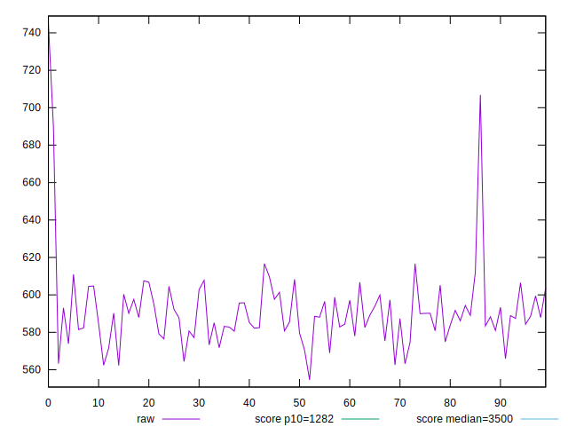
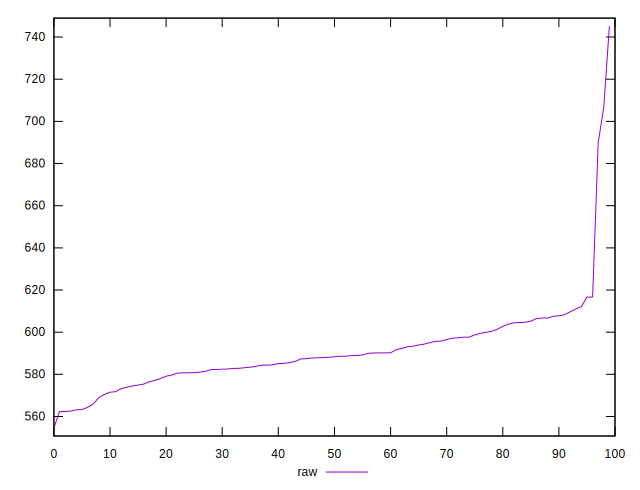
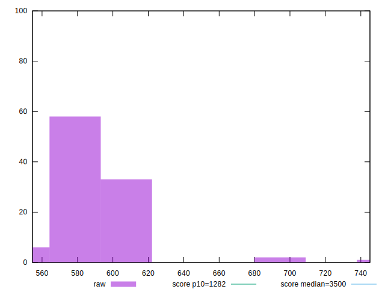
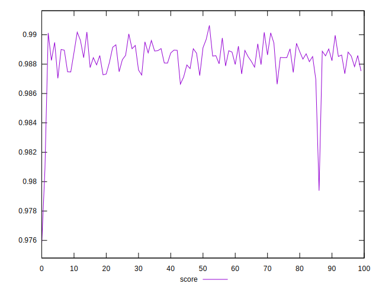
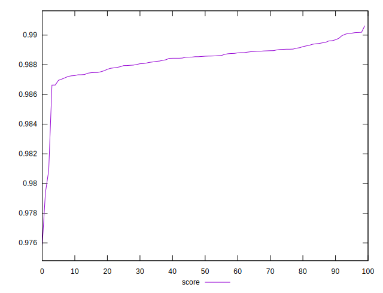
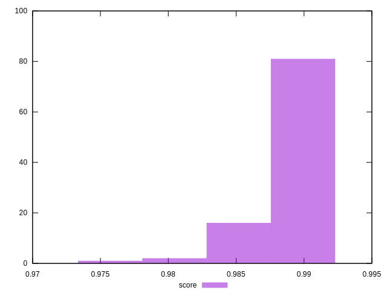

# //bootup-time/samples/pages

[→ Parent](../..)


## Raw


```yaml
p90min: 554.5640000000004
p90max: 607.5200000000002
p90range: 52.95599999999979
p90mean: 586.2636888888893
p90median: 587.3760000000007
p90stdev: 11.947350147528699
p90skewness: -0.32053271253605
p90eccentricity: 0.9999999999999999
p90discretization: 1
outlandishness: 1.0192456630057598

```


## Score


```yaml
p90min: 0.9758012137608907
p90max: 0.9896222909602896
p90range: 0.013821077199398957
p90mean: 0.9880567453350488
p90median: 0.988511062742629
p90stdev: 0.0019184745721714635
p90skewness: -4.454183481446822
p90eccentricity: 0.9999999999999997
p90discretization: 1
outlandishness: 1.0004113324348782

```

