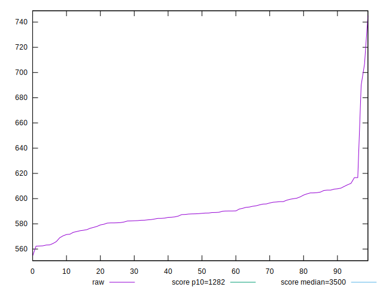
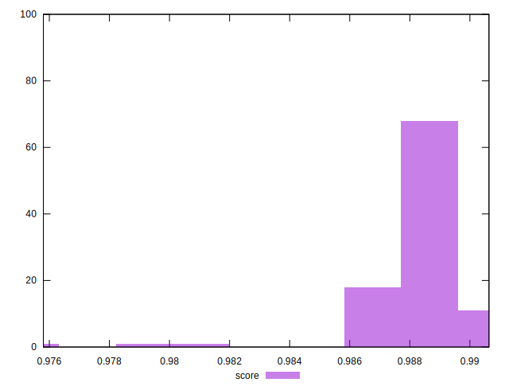

# //bootup-time/samples/pages

[→ Parent](../..)


## Raw


```yaml
p90min: 564.3840000000002
p90max: 616.6800000000002
p90range: 52.295999999999935
p90mean: 589.8643956043962
p90median: 588.5440000000006
p90stdev: 11.729172048460972
p90skewness: 0.20714620432366251
p90eccentricity: 1.0000000000000002
p90discretization: 1
outlandishness: 1.0068400886609854

```


## Score


```yaml
p90min: 0.9866327244510469
p90max: 0.9900557737175536
p90range: 0.003423049266506717
p90mean: 0.9884453027069132
p90median: 0.9885458223746785
p90stdev: 0.0007692721468986953
p90skewness: -0.2882406054667679
p90eccentricity: 1.0000000000000007
p90discretization: 1
outlandishness: 0.9996249646009105

```

