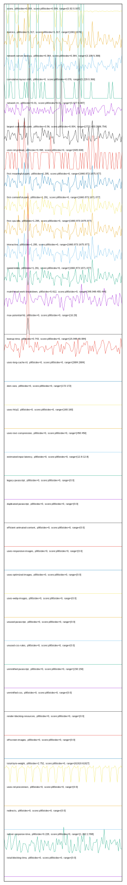

# //correlation/pages+cached+noexternal+nofonts+nosvg+noimg+nocss

[→ Parent](../..)

[0. score, p90stdev=0.004, score:p90stdev=0.004, range=[0.92:0.937]](../../meta/score/samples/pages+cached+noexternal+nofonts+nosvg+noimg+nocss)  
[1. metrics, p90stdev=1.317, score:p90stdev=1.317, range=[1661:1676]](../../metrics/samples/pages+cached+noexternal+nofonts+nosvg+noimg+nocss/)  
[2. network-server-latency, p90stdev=0.364, score:p90stdev=0.364, range=[3.108:5.399]](../../network-server-latency/samples/pages+cached+noexternal+nofonts+nosvg+noimg+nocss/)  
[3. cumulative-layout-shift, p90stdev=0, score:p90stdev=0.076, range=[0.229:0.366]](../../cumulative-layout-shift/samples/pages+cached+noexternal+nofonts+nosvg+noimg+nocss/)  
[4. network-rtt, p90stdev=0.01, score:p90stdev=0.01, range=[0.027:0.087]](../../network-rtt/samples/pages+cached+noexternal+nofonts+nosvg+noimg+nocss/)  
[5. largest-contentful-paint, p90stdev=3.56, score:p90stdev=0.004, range=[2722.433:2806.754]](../../largest-contentful-paint/samples/pages+cached+noexternal+nofonts+nosvg+noimg+nocss/)  
[6. uses-rel-preload, p90stdev=0.498, score:p90stdev=0, range=[605:608]](../../uses-rel-preload/samples/pages+cached+noexternal+nofonts+nosvg+noimg+nocss/)  
[7. first-meaningful-paint, p90stdev=1.295, score:p90stdev=0, range=[1660.873:1675.977]](../../first-meaningful-paint/samples/pages+cached+noexternal+nofonts+nosvg+noimg+nocss/)  
[8. first-contentful-paint, p90stdev=1.291, score:p90stdev=0, range=[1660.873:1671.077]](../../first-contentful-paint/samples/pages+cached+noexternal+nofonts+nosvg+noimg+nocss/)  
[9. first-cpu-idle, p90stdev=1.295, score:p90stdev=0, range=[1660.873:1675.977]](../../first-cpu-idle/samples/pages+cached+noexternal+nofonts+nosvg+noimg+nocss/)  
[10. interactive, p90stdev=1.295, score:p90stdev=0, range=[1660.873:1675.977]](../../interactive/samples/pages+cached+noexternal+nofonts+nosvg+noimg+nocss/)  
[11. speed-index, p90stdev=1.291, score:p90stdev=0, range=[1660.873:1671.077]](../../speed-index/samples/pages+cached+noexternal+nofonts+nosvg+noimg+nocss/)  
[12. mainthread-work-breakdown, p90stdev=5.612, score:p90stdev=0, range=[348.948:455.444]](../../mainthread-work-breakdown/samples/pages+cached+noexternal+nofonts+nosvg+noimg+nocss/)  
[13. max-potential-fid, p90stdev=0, score:p90stdev=0, range=[16:29]](../../max-potential-fid/samples/pages+cached+noexternal+nofonts+nosvg+noimg+nocss/)  
[14. bootup-time, p90stdev=0.743, score:p90stdev=0, range=[15.948:49.084]](../../bootup-time/samples/pages+cached+noexternal+nofonts+nosvg+noimg+nocss/)  
[15. uses-long-cache-ttl, p90stdev=0, score:p90stdev=0, range=[2684:2684]](../../uses-long-cache-ttl/samples/pages+cached+noexternal+nofonts+nosvg+noimg+nocss/)  
[16. dom-size, p90stdev=0, score:p90stdev=0, range=[172:172]](../../dom-size/samples/pages+cached+noexternal+nofonts+nosvg+noimg+nocss/)  
[17. uses-http2, p90stdev=0, score:p90stdev=0, range=[160:160]](../../uses-http2/samples/pages+cached+noexternal+nofonts+nosvg+noimg+nocss/)  
[18. uses-text-compression, p90stdev=0, score:p90stdev=0, range=[450:450]](../../uses-text-compression/samples/pages+cached+noexternal+nofonts+nosvg+noimg+nocss/)  
[19. estimated-input-latency, p90stdev=0, score:p90stdev=0, range=[12.8:12.8]](../../estimated-input-latency/samples/pages+cached+noexternal+nofonts+nosvg+noimg+nocss/)  
[20. uses-passive-event-listeners, p90stdev=NaN, score:p90stdev=0, range=[NaN:NaN]](../../uses-passive-event-listeners/samples/pages+cached+noexternal+nofonts+nosvg+noimg+nocss/)  
[21. no-document-write, p90stdev=NaN, score:p90stdev=0, range=[NaN:NaN]](../../no-document-write/samples/pages+cached+noexternal+nofonts+nosvg+noimg+nocss/)  
[22. legacy-javascript, p90stdev=0, score:p90stdev=0, range=[0:0]](../../legacy-javascript/samples/pages+cached+noexternal+nofonts+nosvg+noimg+nocss/)  
[23. duplicated-javascript, p90stdev=0, score:p90stdev=0, range=[0:0]](../../duplicated-javascript/samples/pages+cached+noexternal+nofonts+nosvg+noimg+nocss/)  
[24. efficient-animated-content, p90stdev=0, score:p90stdev=0, range=[0:0]](../../efficient-animated-content/samples/pages+cached+noexternal+nofonts+nosvg+noimg+nocss/)  
[25. uses-responsive-images, p90stdev=0, score:p90stdev=0, range=[0:0]](../../uses-responsive-images/samples/pages+cached+noexternal+nofonts+nosvg+noimg+nocss/)  
[26. uses-optimized-images, p90stdev=0, score:p90stdev=0, range=[0:0]](../../uses-optimized-images/samples/pages+cached+noexternal+nofonts+nosvg+noimg+nocss/)  
[27. uses-webp-images, p90stdev=0, score:p90stdev=0, range=[0:0]](../../uses-webp-images/samples/pages+cached+noexternal+nofonts+nosvg+noimg+nocss/)  
[28. unused-javascript, p90stdev=0, score:p90stdev=0, range=[0:0]](../../unused-javascript/samples/pages+cached+noexternal+nofonts+nosvg+noimg+nocss/)  
[29. unused-css-rules, p90stdev=0, score:p90stdev=0, range=[0:0]](../../unused-css-rules/samples/pages+cached+noexternal+nofonts+nosvg+noimg+nocss/)  
[30. unminified-javascript, p90stdev=0, score:p90stdev=0, range=[150:150]](../../unminified-javascript/samples/pages+cached+noexternal+nofonts+nosvg+noimg+nocss/)  
[31. unminified-css, p90stdev=0, score:p90stdev=0, range=[0:0]](../../unminified-css/samples/pages+cached+noexternal+nofonts+nosvg+noimg+nocss/)  
[32. render-blocking-resources, p90stdev=0, score:p90stdev=0, range=[0:0]](../../render-blocking-resources/samples/pages+cached+noexternal+nofonts+nosvg+noimg+nocss/)  
[33. offscreen-images, p90stdev=0, score:p90stdev=0, range=[0:0]](../../offscreen-images/samples/pages+cached+noexternal+nofonts+nosvg+noimg+nocss/)  
[34. total-byte-weight, p90stdev=2.752, score:p90stdev=0, range=[61919:61927]](../../total-byte-weight/samples/pages+cached+noexternal+nofonts+nosvg+noimg+nocss/)  
[35. unsized-images, p90stdev=NaN, score:p90stdev=0, range=[NaN:NaN]](../../unsized-images/samples/pages+cached+noexternal+nofonts+nosvg+noimg+nocss/)  
[36. third-party-summary, p90stdev=NaN, score:p90stdev=0, range=[NaN:NaN]](../../third-party-summary/samples/pages+cached+noexternal+nofonts+nosvg+noimg+nocss/)  
[37. font-display, p90stdev=NaN, score:p90stdev=0, range=[NaN:NaN]](../../font-display/samples/pages+cached+noexternal+nofonts+nosvg+noimg+nocss/)  
[38. uses-rel-preconnect, p90stdev=0, score:p90stdev=0, range=[0:0]](../../uses-rel-preconnect/samples/pages+cached+noexternal+nofonts+nosvg+noimg+nocss/)  
[39. redirects, p90stdev=0, score:p90stdev=0, range=[0:0]](../../redirects/samples/pages+cached+noexternal+nofonts+nosvg+noimg+nocss/)  
[40. server-response-time, p90stdev=0.228, score:p90stdev=0, range=[1.262:2.558]](../../server-response-time/samples/pages+cached+noexternal+nofonts+nosvg+noimg+nocss/)  
[41. total-blocking-time, p90stdev=0, score:p90stdev=0, range=[0:0]](../../total-blocking-time/samples/pages+cached+noexternal+nofonts+nosvg+noimg+nocss/)  
[42. non-composited-animations, p90stdev=NaN, score:p90stdev=NaN, range=[NaN:NaN]](../../non-composited-animations/samples/pages+cached+noexternal+nofonts+nosvg+noimg+nocss/)  
[43. long-tasks, p90stdev=NaN, score:p90stdev=NaN, range=[NaN:NaN]](../../long-tasks/samples/pages+cached+noexternal+nofonts+nosvg+noimg+nocss/)  
[44. layout-shift-elements, p90stdev=NaN, score:p90stdev=NaN, range=[NaN:NaN]](../../layout-shift-elements/samples/pages+cached+noexternal+nofonts+nosvg+noimg+nocss/)  
[45. largest-contentful-paint-element, p90stdev=NaN, score:p90stdev=NaN, range=[NaN:NaN]](../../largest-contentful-paint-element/samples/pages+cached+noexternal+nofonts+nosvg+noimg+nocss/)  
[46. resource-summary, p90stdev=NaN, score:p90stdev=NaN, range=[NaN:NaN]](../../resource-summary/samples/pages+cached+noexternal+nofonts+nosvg+noimg+nocss/)  
[47. timing-budget, p90stdev=NaN, score:p90stdev=NaN, range=[NaN:NaN]](../../timing-budget/samples/pages+cached+noexternal+nofonts+nosvg+noimg+nocss/)  
[48. performance-budget, p90stdev=NaN, score:p90stdev=NaN, range=[NaN:NaN]](../../performance-budget/samples/pages+cached+noexternal+nofonts+nosvg+noimg+nocss/)  
[49. main-thread-tasks, p90stdev=NaN, score:p90stdev=NaN, range=[NaN:NaN]](../../main-thread-tasks/samples/pages+cached+noexternal+nofonts+nosvg+noimg+nocss/)  
[50. network-requests, p90stdev=NaN, score:p90stdev=NaN, range=[NaN:NaN]](../../network-requests/samples/pages+cached+noexternal+nofonts+nosvg+noimg+nocss/)  
[51. diagnostics, p90stdev=NaN, score:p90stdev=NaN, range=[NaN:NaN]](../../diagnostics/samples/pages+cached+noexternal+nofonts+nosvg+noimg+nocss/)  
[52. critical-request-chains, p90stdev=NaN, score:p90stdev=NaN, range=[NaN:NaN]](../../critical-request-chains/samples/pages+cached+noexternal+nofonts+nosvg+noimg+nocss/)  
[53. user-timings, p90stdev=NaN, score:p90stdev=NaN, range=[NaN:NaN]](../../user-timings/samples/pages+cached+noexternal+nofonts+nosvg+noimg+nocss/)  
[54. final-screenshot, p90stdev=NaN, score:p90stdev=NaN, range=[NaN:NaN]](../../final-screenshot/samples/pages+cached+noexternal+nofonts+nosvg+noimg+nocss/)  
[55. screenshot-thumbnails, p90stdev=NaN, score:p90stdev=NaN, range=[NaN:NaN]](../../screenshot-thumbnails/samples/pages+cached+noexternal+nofonts+nosvg+noimg+nocss/)  
