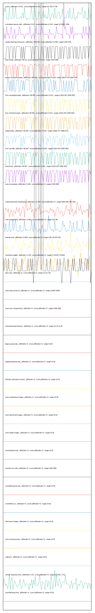

# //correlation/pages+cached+noexternal+noimg

[→ Parent](../..)

[0. score, p90stdev=0.011, score:p90stdev=0.011, range=[0.716:0.779]](../../meta/score/samples/pages+cached+noexternal+noimg)  
[1. metrics, p90stdev=98.969, score:p90stdev=98.969, range=[1815:2051]](../../metrics/samples/pages+cached+noexternal+noimg/)  
[2. network-server-latency, p90stdev=0.306, score:p90stdev=0.306, range=[3.483:6.24]](../../network-server-latency/samples/pages+cached+noexternal+noimg/)  
[3. cumulative-layout-shift, p90stdev=0.07, score:p90stdev=0.161, range=[0.094:1.129]](../../cumulative-layout-shift/samples/pages+cached+noexternal+noimg/)  
[4. render-blocking-resources, p90stdev=139.045, score:p90stdev=0.095, range=[156:471]](../../render-blocking-resources/samples/pages+cached+noexternal+noimg/)  
[5. uses-http2, p90stdev=68.15, score:p90stdev=0.054, range=[160:330]](../../uses-http2/samples/pages+cached+noexternal+noimg/)  
[6. largest-contentful-paint, p90stdev=368.321, score:p90stdev=0.034, range=[5677.471:6529.476]](../../largest-contentful-paint/samples/pages+cached+noexternal+noimg/)  
[7. first-meaningful-paint, p90stdev=98.967, score:p90stdev=0.011, range=[1814.657:2050.667]](../../first-meaningful-paint/samples/pages+cached+noexternal+noimg/)  
[8. first-contentful-paint, p90stdev=98.967, score:p90stdev=0.011, range=[1814.657:2050.667]](../../first-contentful-paint/samples/pages+cached+noexternal+noimg/)  
[9. network-rtt, p90stdev=0.01, score:p90stdev=0.01, range=[0.047:0.244]](../../network-rtt/samples/pages+cached+noexternal+noimg/)  
[10. speed-index, p90stdev=46.035, score:p90stdev=0.003, range=[2383.477:2688.971]](../../speed-index/samples/pages+cached+noexternal+noimg/)  
[11. first-cpu-idle, p90stdev=98.967, score:p90stdev=0.002, range=[1814.657:2050.667]](../../first-cpu-idle/samples/pages+cached+noexternal+noimg/)  
[12. interactive, p90stdev=98.967, score:p90stdev=0.001, range=[1814.657:2050.667]](../../interactive/samples/pages+cached+noexternal+noimg/)  
[13. uses-rel-preload, p90stdev=0.466, score:p90stdev=0, range=[453:605]](../../uses-rel-preload/samples/pages+cached+noexternal+noimg/)  
[14. mainthread-work-breakdown, p90stdev=12.548, score:p90stdev=0, range=[685.388:786.792]](../../mainthread-work-breakdown/samples/pages+cached+noexternal+noimg/)  
[15. max-potential-fid, p90stdev=2.096, score:p90stdev=0, range=[25:38]](../../max-potential-fid/samples/pages+cached+noexternal+noimg/)  
[16. bootup-time, p90stdev=0.864, score:p90stdev=0, range=[39.744:48.372]](../../bootup-time/samples/pages+cached+noexternal+noimg/)  
[17. total-byte-weight, p90stdev=4.152, score:p90stdev=0, range=[713134:713164]](../../total-byte-weight/samples/pages+cached+noexternal+noimg/)  
[18. dom-size, p90stdev=0, score:p90stdev=0, range=[172:172]](../../dom-size/samples/pages+cached+noexternal+noimg/)  
[19. uses-long-cache-ttl, p90stdev=0, score:p90stdev=0, range=[1830:1830]](../../uses-long-cache-ttl/samples/pages+cached+noexternal+noimg/)  
[20. uses-text-compression, p90stdev=0, score:p90stdev=0, range=[450:450]](../../uses-text-compression/samples/pages+cached+noexternal+noimg/)  
[21. estimated-input-latency, p90stdev=0, score:p90stdev=0, range=[12.8:12.8]](../../estimated-input-latency/samples/pages+cached+noexternal+noimg/)  
[22. uses-passive-event-listeners, p90stdev=NaN, score:p90stdev=0, range=[NaN:NaN]](../../uses-passive-event-listeners/samples/pages+cached+noexternal+noimg/)  
[23. no-document-write, p90stdev=NaN, score:p90stdev=0, range=[NaN:NaN]](../../no-document-write/samples/pages+cached+noexternal+noimg/)  
[24. legacy-javascript, p90stdev=0, score:p90stdev=0, range=[0:0]](../../legacy-javascript/samples/pages+cached+noexternal+noimg/)  
[25. duplicated-javascript, p90stdev=0, score:p90stdev=0, range=[0:0]](../../duplicated-javascript/samples/pages+cached+noexternal+noimg/)  
[26. efficient-animated-content, p90stdev=0, score:p90stdev=0, range=[0:0]](../../efficient-animated-content/samples/pages+cached+noexternal+noimg/)  
[27. uses-responsive-images, p90stdev=0, score:p90stdev=0, range=[0:0]](../../uses-responsive-images/samples/pages+cached+noexternal+noimg/)  
[28. uses-optimized-images, p90stdev=0, score:p90stdev=0, range=[0:0]](../../uses-optimized-images/samples/pages+cached+noexternal+noimg/)  
[29. uses-webp-images, p90stdev=0, score:p90stdev=0, range=[0:0]](../../uses-webp-images/samples/pages+cached+noexternal+noimg/)  
[30. unused-javascript, p90stdev=0, score:p90stdev=0, range=[0:0]](../../unused-javascript/samples/pages+cached+noexternal+noimg/)  
[31. unused-css-rules, p90stdev=0, score:p90stdev=0, range=[300:300]](../../unused-css-rules/samples/pages+cached+noexternal+noimg/)  
[32. unminified-javascript, p90stdev=0, score:p90stdev=0, range=[0:0]](../../unminified-javascript/samples/pages+cached+noexternal+noimg/)  
[33. unminified-css, p90stdev=0, score:p90stdev=0, range=[0:0]](../../unminified-css/samples/pages+cached+noexternal+noimg/)  
[34. offscreen-images, p90stdev=0, score:p90stdev=0, range=[0:0]](../../offscreen-images/samples/pages+cached+noexternal+noimg/)  
[35. unsized-images, p90stdev=NaN, score:p90stdev=0, range=[NaN:NaN]](../../unsized-images/samples/pages+cached+noexternal+noimg/)  
[36. third-party-summary, p90stdev=NaN, score:p90stdev=0, range=[NaN:NaN]](../../third-party-summary/samples/pages+cached+noexternal+noimg/)  
[37. font-display, p90stdev=NaN, score:p90stdev=0, range=[NaN:NaN]](../../font-display/samples/pages+cached+noexternal+noimg/)  
[38. uses-rel-preconnect, p90stdev=0, score:p90stdev=0, range=[0:0]](../../uses-rel-preconnect/samples/pages+cached+noexternal+noimg/)  
[39. redirects, p90stdev=0, score:p90stdev=0, range=[0:0]](../../redirects/samples/pages+cached+noexternal+noimg/)  
[40. server-response-time, p90stdev=0.22, score:p90stdev=0, range=[1.319:2.771]](../../server-response-time/samples/pages+cached+noexternal+noimg/)  
[41. total-blocking-time, p90stdev=0, score:p90stdev=0, range=[0:0]](../../total-blocking-time/samples/pages+cached+noexternal+noimg/)  
[42. non-composited-animations, p90stdev=NaN, score:p90stdev=NaN, range=[NaN:NaN]](../../non-composited-animations/samples/pages+cached+noexternal+noimg/)  
[43. long-tasks, p90stdev=NaN, score:p90stdev=NaN, range=[NaN:NaN]](../../long-tasks/samples/pages+cached+noexternal+noimg/)  
[44. layout-shift-elements, p90stdev=NaN, score:p90stdev=NaN, range=[NaN:NaN]](../../layout-shift-elements/samples/pages+cached+noexternal+noimg/)  
[45. largest-contentful-paint-element, p90stdev=NaN, score:p90stdev=NaN, range=[NaN:NaN]](../../largest-contentful-paint-element/samples/pages+cached+noexternal+noimg/)  
[46. resource-summary, p90stdev=NaN, score:p90stdev=NaN, range=[NaN:NaN]](../../resource-summary/samples/pages+cached+noexternal+noimg/)  
[47. timing-budget, p90stdev=NaN, score:p90stdev=NaN, range=[NaN:NaN]](../../timing-budget/samples/pages+cached+noexternal+noimg/)  
[48. performance-budget, p90stdev=NaN, score:p90stdev=NaN, range=[NaN:NaN]](../../performance-budget/samples/pages+cached+noexternal+noimg/)  
[49. main-thread-tasks, p90stdev=NaN, score:p90stdev=NaN, range=[NaN:NaN]](../../main-thread-tasks/samples/pages+cached+noexternal+noimg/)  
[50. network-requests, p90stdev=NaN, score:p90stdev=NaN, range=[NaN:NaN]](../../network-requests/samples/pages+cached+noexternal+noimg/)  
[51. diagnostics, p90stdev=NaN, score:p90stdev=NaN, range=[NaN:NaN]](../../diagnostics/samples/pages+cached+noexternal+noimg/)  
[52. critical-request-chains, p90stdev=NaN, score:p90stdev=NaN, range=[NaN:NaN]](../../critical-request-chains/samples/pages+cached+noexternal+noimg/)  
[53. user-timings, p90stdev=NaN, score:p90stdev=NaN, range=[NaN:NaN]](../../user-timings/samples/pages+cached+noexternal+noimg/)  
[54. final-screenshot, p90stdev=NaN, score:p90stdev=NaN, range=[NaN:NaN]](../../final-screenshot/samples/pages+cached+noexternal+noimg/)  
[55. screenshot-thumbnails, p90stdev=NaN, score:p90stdev=NaN, range=[NaN:NaN]](../../screenshot-thumbnails/samples/pages+cached+noexternal+noimg/)  
