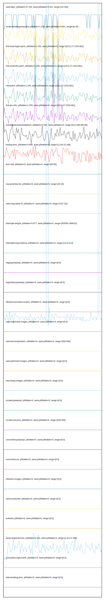

# //correlation/pages+cached+noexternal+nojs

[→ Parent](../..)

[0. score, p90stdev=NaN, score:p90stdev=NaN, range=[NaN:NaN]](../../meta/score/samples/pages+cached+noexternal+nojs)  
[1. uses-http2, p90stdev=37.195, score:p90stdev=0.031, range=[10:160]](../../uses-http2/samples/pages+cached+noexternal+nojs/)  
[2. render-blocking-resources, p90stdev=1.238, score:p90stdev=0.001, range=[0:16]](../../render-blocking-resources/samples/pages+cached+noexternal+nojs/)  
[3. first-meaningful-paint, p90stdev=1.259, score:p90stdev=0, range=[1512.27:1533.681]](../../first-meaningful-paint/samples/pages+cached+noexternal+nojs/)  
[4. first-contentful-paint, p90stdev=1.259, score:p90stdev=0, range=[1512.27:1533.681]](../../first-contentful-paint/samples/pages+cached+noexternal+nojs/)  
[5. interactive, p90stdev=1.259, score:p90stdev=0, range=[1512.27:1533.681]](../../interactive/samples/pages+cached+noexternal+nojs/)  
[6. first-cpu-idle, p90stdev=1.259, score:p90stdev=0, range=[1512.27:1533.681]](../../first-cpu-idle/samples/pages+cached+noexternal+nojs/)  
[7. mainthread-work-breakdown, p90stdev=5.044, score:p90stdev=0, range=[412.496:450.98]](../../mainthread-work-breakdown/samples/pages+cached+noexternal+nojs/)  
[8. bootup-time, p90stdev=0.666, score:p90stdev=0, range=[11.64:15.188]](../../bootup-time/samples/pages+cached+noexternal+nojs/)  
[9. dom-size, p90stdev=0, score:p90stdev=0, range=[59:59]](../../dom-size/samples/pages+cached+noexternal+nojs/)  
[10. max-potential-fid, p90stdev=0, score:p90stdev=0, range=[16:16]](../../max-potential-fid/samples/pages+cached+noexternal+nojs/)  
[11. uses-long-cache-ttl, p90stdev=0, score:p90stdev=0, range=[732:732]](../../uses-long-cache-ttl/samples/pages+cached+noexternal+nojs/)  
[12. total-byte-weight, p90stdev=5.977, score:p90stdev=0, range=[455561:466013]](../../total-byte-weight/samples/pages+cached+noexternal+nojs/)  
[13. estimated-input-latency, p90stdev=0, score:p90stdev=0, range=[12.8:12.8]](../../estimated-input-latency/samples/pages+cached+noexternal+nojs/)  
[14. uses-passive-event-listeners, p90stdev=NaN, score:p90stdev=0, range=[NaN:NaN]](../../uses-passive-event-listeners/samples/pages+cached+noexternal+nojs/)  
[15. no-document-write, p90stdev=NaN, score:p90stdev=0, range=[NaN:NaN]](../../no-document-write/samples/pages+cached+noexternal+nojs/)  
[16. legacy-javascript, p90stdev=0, score:p90stdev=0, range=[0:0]](../../legacy-javascript/samples/pages+cached+noexternal+nojs/)  
[17. duplicated-javascript, p90stdev=0, score:p90stdev=0, range=[0:0]](../../duplicated-javascript/samples/pages+cached+noexternal+nojs/)  
[18. efficient-animated-content, p90stdev=0, score:p90stdev=0, range=[0:0]](../../efficient-animated-content/samples/pages+cached+noexternal+nojs/)  
[19. uses-responsive-images, p90stdev=0, score:p90stdev=0, range=[0:0]](../../uses-responsive-images/samples/pages+cached+noexternal+nojs/)  
[20. uses-text-compression, p90stdev=0, score:p90stdev=0, range=[300:300]](../../uses-text-compression/samples/pages+cached+noexternal+nojs/)  
[21. uses-optimized-images, p90stdev=0, score:p90stdev=0, range=[0:0]](../../uses-optimized-images/samples/pages+cached+noexternal+nojs/)  
[22. uses-webp-images, p90stdev=0, score:p90stdev=0, range=[0:0]](../../uses-webp-images/samples/pages+cached+noexternal+nojs/)  
[23. unused-javascript, p90stdev=0, score:p90stdev=0, range=[0:0]](../../unused-javascript/samples/pages+cached+noexternal+nojs/)  
[24. unused-css-rules, p90stdev=0, score:p90stdev=0, range=[300:300]](../../unused-css-rules/samples/pages+cached+noexternal+nojs/)  
[25. unminified-javascript, p90stdev=0, score:p90stdev=0, range=[0:0]](../../unminified-javascript/samples/pages+cached+noexternal+nojs/)  
[26. unminified-css, p90stdev=0, score:p90stdev=0, range=[0:0]](../../unminified-css/samples/pages+cached+noexternal+nojs/)  
[27. offscreen-images, p90stdev=0, score:p90stdev=0, range=[0:0]](../../offscreen-images/samples/pages+cached+noexternal+nojs/)  
[28. unsized-images, p90stdev=NaN, score:p90stdev=0, range=[NaN:NaN]](../../unsized-images/samples/pages+cached+noexternal+nojs/)  
[29. third-party-summary, p90stdev=NaN, score:p90stdev=0, range=[NaN:NaN]](../../third-party-summary/samples/pages+cached+noexternal+nojs/)  
[30. font-display, p90stdev=NaN, score:p90stdev=0, range=[NaN:NaN]](../../font-display/samples/pages+cached+noexternal+nojs/)  
[31. uses-rel-preload, p90stdev=0, score:p90stdev=0, range=[0:0]](../../uses-rel-preload/samples/pages+cached+noexternal+nojs/)  
[32. redirects, p90stdev=0, score:p90stdev=0, range=[0:0]](../../redirects/samples/pages+cached+noexternal+nojs/)  
[33. server-response-time, p90stdev=0.124, score:p90stdev=0, range=[1.414:2.398]](../../server-response-time/samples/pages+cached+noexternal+nojs/)  
[34. cumulative-layout-shift, p90stdev=0, score:p90stdev=0, range=[0:0]](../../cumulative-layout-shift/samples/pages+cached+noexternal+nojs/)  
[35. total-blocking-time, p90stdev=0, score:p90stdev=0, range=[0:0]](../../total-blocking-time/samples/pages+cached+noexternal+nojs/)  
[36. timing-budget, p90stdev=NaN, score:p90stdev=NaN, range=[NaN:NaN]](../../timing-budget/samples/pages+cached+noexternal+nojs/)  
[37. metrics, p90stdev=NaN, score:p90stdev=NaN, range=[NaN:NaN]](../../metrics/samples/pages+cached+noexternal+nojs/)  
[38. uses-rel-preconnect, p90stdev=NaN, score:p90stdev=NaN, range=[NaN:NaN]](../../uses-rel-preconnect/samples/pages+cached+noexternal+nojs/)  
[39. screenshot-thumbnails, p90stdev=NaN, score:p90stdev=NaN, range=[NaN:NaN]](../../screenshot-thumbnails/samples/pages+cached+noexternal+nojs/)  
[40. speed-index, p90stdev=NaN, score:p90stdev=NaN, range=[NaN:NaN]](../../speed-index/samples/pages+cached+noexternal+nojs/)  
[41. largest-contentful-paint, p90stdev=NaN, score:p90stdev=NaN, range=[NaN:NaN]](../../largest-contentful-paint/samples/pages+cached+noexternal+nojs/)  
