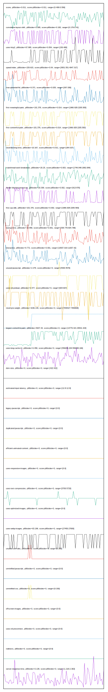

# //correlation/pages+cached+nointeractive

[→ Parent](../..)

[0. score, p90stdev=0.012, score:p90stdev=0.012, range=[0.499:0.556]](../../meta/score/samples/pages+cached+nointeractive)  
[1. metrics, p90stdev=9.385, score:p90stdev=9.385, range=[10937:11007]](../../metrics/samples/pages+cached+nointeractive/)  
[2. network-server-latency, p90stdev=0.842, score:p90stdev=0.842, range=[4.707:9.916]](../../network-server-latency/samples/pages+cached+nointeractive/)  
[3. third-party-summary, p90stdev=NaN, score:p90stdev=0.475, range=[NaN:NaN]](../../third-party-summary/samples/pages+cached+nointeractive/)  
[4. cumulative-layout-shift, p90stdev=0.095, score:p90stdev=0.182, range=[0.179:0.41]](../../cumulative-layout-shift/samples/pages+cached+nointeractive/)  
[5. network-rtt, p90stdev=0.07, score:p90stdev=0.07, range=[0.101:0.486]](../../network-rtt/samples/pages+cached+nointeractive/)  
[6. uses-http2, p90stdev=67.515, score:p90stdev=0.061, range=[150:480]](../../uses-http2/samples/pages+cached+nointeractive/)  
[7. speed-index, p90stdev=224.564, score:p90stdev=0.047, range=[3831.551:4947.317]](../../speed-index/samples/pages+cached+nointeractive/)  
[8. max-potential-fid, p90stdev=9.192, score:p90stdev=0.033, range=[267:330]](../../max-potential-fid/samples/pages+cached+nointeractive/)  
[9. unused-css-rules, p90stdev=0, score:p90stdev=0.018, range=[0:150]](../../unused-css-rules/samples/pages+cached+nointeractive/)  
[10. unminified-css, p90stdev=0, score:p90stdev=0.018, range=[0:150]](../../unminified-css/samples/pages+cached+nointeractive/)  
[11. total-blocking-time, p90stdev=10.008, score:p90stdev=0.014, range=[264:327]](../../total-blocking-time/samples/pages+cached+nointeractive/)  
[12. first-meaningful-paint, p90stdev=106.089, score:p90stdev=0.014, range=[1966.928:2205.583]](../../first-meaningful-paint/samples/pages+cached+nointeractive/)  
[13. first-contentful-paint, p90stdev=106.089, score:p90stdev=0.014, range=[1966.928:2205.583]](../../first-contentful-paint/samples/pages+cached+nointeractive/)  
[14. mainthread-work-breakdown, p90stdev=20.81, score:p90stdev=0.003, range=[1749.048:1892.084]](../../mainthread-work-breakdown/samples/pages+cached+nointeractive/)  
[15. render-blocking-resources, p90stdev=20.04, score:p90stdev=0.003, range=[913:976]](../../render-blocking-resources/samples/pages+cached+nointeractive/)  
[16. first-cpu-idle, p90stdev=106.089, score:p90stdev=0.002, range=[1966.928:2205.583]](../../first-cpu-idle/samples/pages+cached+nointeractive/)  
[17. bootup-time, p90stdev=10.761, score:p90stdev=0.001, range=[538.776:604.788]](../../bootup-time/samples/pages+cached+nointeractive/)  
[18. interactive, p90stdev=9.407, score:p90stdev=0.001, range=[10937.019:11007.42]](../../interactive/samples/pages+cached+nointeractive/)  
[19. uses-rel-preload, p90stdev=0.542, score:p90stdev=0, range=[604:607]](../../uses-rel-preload/samples/pages+cached+nointeractive/)  
[20. unused-javascript, p90stdev=5.353, score:p90stdev=0, range=[4530:4570]](../../unused-javascript/samples/pages+cached+nointeractive/)  
[21. total-byte-weight, p90stdev=4826.544, score:p90stdev=0, range=[7949427:7959908]](../../total-byte-weight/samples/pages+cached+nointeractive/)  
[22. largest-contentful-paint, p90stdev=5728.791, score:p90stdev=0, range=[14779.421:29531.423]](../../largest-contentful-paint/samples/pages+cached+nointeractive/)  
[23. uses-long-cache-ttl, p90stdev=6.763, score:p90stdev=0, range=[559296.204:559338.166]](../../uses-long-cache-ttl/samples/pages+cached+nointeractive/)  
[24. dom-size, p90stdev=0, score:p90stdev=0, range=[422:422]](../../dom-size/samples/pages+cached+nointeractive/)  
[25. estimated-input-latency, p90stdev=0, score:p90stdev=0, range=[12.8:12.8]](../../estimated-input-latency/samples/pages+cached+nointeractive/)  
[26. uses-passive-event-listeners, p90stdev=NaN, score:p90stdev=0, range=[NaN:NaN]](../../uses-passive-event-listeners/samples/pages+cached+nointeractive/)  
[27. no-document-write, p90stdev=NaN, score:p90stdev=0, range=[NaN:NaN]](../../no-document-write/samples/pages+cached+nointeractive/)  
[28. legacy-javascript, p90stdev=0, score:p90stdev=0, range=[0:0]](../../legacy-javascript/samples/pages+cached+nointeractive/)  
[29. duplicated-javascript, p90stdev=0, score:p90stdev=0, range=[0:0]](../../duplicated-javascript/samples/pages+cached+nointeractive/)  
[30. efficient-animated-content, p90stdev=0, score:p90stdev=0, range=[0:0]](../../efficient-animated-content/samples/pages+cached+nointeractive/)  
[31. uses-responsive-images, p90stdev=0, score:p90stdev=0, range=[0:0]](../../uses-responsive-images/samples/pages+cached+nointeractive/)  
[32. uses-text-compression, p90stdev=2.291, score:p90stdev=0, range=[5700:5720]](../../uses-text-compression/samples/pages+cached+nointeractive/)  
[33. uses-optimized-images, p90stdev=0, score:p90stdev=0, range=[0:0]](../../uses-optimized-images/samples/pages+cached+nointeractive/)  
[34. uses-webp-images, p90stdev=70.711, score:p90stdev=0, range=[27450:27600]](../../uses-webp-images/samples/pages+cached+nointeractive/)  
[35. unminified-javascript, p90stdev=0, score:p90stdev=0, range=[0:0]](../../unminified-javascript/samples/pages+cached+nointeractive/)  
[36. offscreen-images, p90stdev=0, score:p90stdev=0, range=[0:0]](../../offscreen-images/samples/pages+cached+nointeractive/)  
[37. unsized-images, p90stdev=NaN, score:p90stdev=0, range=[NaN:NaN]](../../unsized-images/samples/pages+cached+nointeractive/)  
[38. font-display, p90stdev=NaN, score:p90stdev=0, range=[NaN:NaN]](../../font-display/samples/pages+cached+nointeractive/)  
[39. uses-rel-preconnect, p90stdev=0, score:p90stdev=0, range=[0:0]](../../uses-rel-preconnect/samples/pages+cached+nointeractive/)  
[40. redirects, p90stdev=0, score:p90stdev=0, range=[0:0]](../../redirects/samples/pages+cached+nointeractive/)  
[41. server-response-time, p90stdev=0.136, score:p90stdev=0, range=[1.218:2.363]](../../server-response-time/samples/pages+cached+nointeractive/)  
[42. non-composited-animations, p90stdev=NaN, score:p90stdev=NaN, range=[NaN:NaN]](../../non-composited-animations/samples/pages+cached+nointeractive/)  
[43. long-tasks, p90stdev=NaN, score:p90stdev=NaN, range=[NaN:NaN]](../../long-tasks/samples/pages+cached+nointeractive/)  
[44. layout-shift-elements, p90stdev=NaN, score:p90stdev=NaN, range=[NaN:NaN]](../../layout-shift-elements/samples/pages+cached+nointeractive/)  
[45. largest-contentful-paint-element, p90stdev=NaN, score:p90stdev=NaN, range=[NaN:NaN]](../../largest-contentful-paint-element/samples/pages+cached+nointeractive/)  
[46. resource-summary, p90stdev=NaN, score:p90stdev=NaN, range=[NaN:NaN]](../../resource-summary/samples/pages+cached+nointeractive/)  
[47. timing-budget, p90stdev=NaN, score:p90stdev=NaN, range=[NaN:NaN]](../../timing-budget/samples/pages+cached+nointeractive/)  
[48. performance-budget, p90stdev=NaN, score:p90stdev=NaN, range=[NaN:NaN]](../../performance-budget/samples/pages+cached+nointeractive/)  
[49. main-thread-tasks, p90stdev=NaN, score:p90stdev=NaN, range=[NaN:NaN]](../../main-thread-tasks/samples/pages+cached+nointeractive/)  
[50. network-requests, p90stdev=NaN, score:p90stdev=NaN, range=[NaN:NaN]](../../network-requests/samples/pages+cached+nointeractive/)  
[51. diagnostics, p90stdev=NaN, score:p90stdev=NaN, range=[NaN:NaN]](../../diagnostics/samples/pages+cached+nointeractive/)  
[52. critical-request-chains, p90stdev=NaN, score:p90stdev=NaN, range=[NaN:NaN]](../../critical-request-chains/samples/pages+cached+nointeractive/)  
[53. user-timings, p90stdev=NaN, score:p90stdev=NaN, range=[NaN:NaN]](../../user-timings/samples/pages+cached+nointeractive/)  
[54. final-screenshot, p90stdev=NaN, score:p90stdev=NaN, range=[NaN:NaN]](../../final-screenshot/samples/pages+cached+nointeractive/)  
[55. screenshot-thumbnails, p90stdev=NaN, score:p90stdev=NaN, range=[NaN:NaN]](../../screenshot-thumbnails/samples/pages+cached+nointeractive/)  
