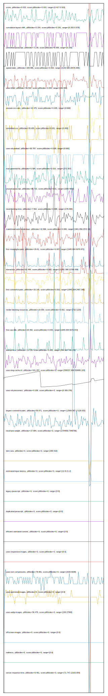

# //correlation/pages

[→ Parent](../..)

[0. score, p90stdev=0.016, score:p90stdev=0.016, range=[0.417:0.515]](../../meta/score/samples/pages)  
[1. metrics, p90stdev=67.684, score:p90stdev=67.684, range=[11391:12706]](../../metrics/samples/pages/)  
[2. network-server-latency, p90stdev=9.536, score:p90stdev=9.536, range=[712.569:945.039]](../../network-server-latency/samples/pages/)  
[3. network-rtt, p90stdev=0.948, score:p90stdev=0.948, range=[1.384:5.424]](../../network-rtt/samples/pages/)  
[4. third-party-summary, p90stdev=NaN, score:p90stdev=0.229, range=[NaN:NaN]](../../third-party-summary/samples/pages/)  
[5. cumulative-layout-shift, p90stdev=0.168, score:p90stdev=0.189, range=[0.202:0.579]](../../cumulative-layout-shift/samples/pages/)  
[6. server-response-time, p90stdev=2.372, score:p90stdev=0.147, range=[71.747:12103.054]](../../server-response-time/samples/pages/)  
[7. first-meaningful-paint, p90stdev=17.791, score:p90stdev=0.096, range=[1945.004:5079.972]](../../first-meaningful-paint/samples/pages/)  
[8. speed-index, p90stdev=323.11, score:p90stdev=0.09, range=[5140.588:29476.905]](../../speed-index/samples/pages/)  
[9. unminified-javascript, p90stdev=74.536, score:p90stdev=0.059, range=[0:150]](../../unminified-javascript/samples/pages/)  
[10. uses-http2, p90stdev=55.298, score:p90stdev=0.05, range=[160:900]](../../uses-http2/samples/pages/)  
[11. unused-css-rules, p90stdev=42.687, score:p90stdev=0.046, range=[0:600]](../../unused-css-rules/samples/pages/)  
[12. first-cpu-idle, p90stdev=17.791, score:p90stdev=0.041, range=[1945.004:5079.972]](../../first-cpu-idle/samples/pages/)  
[13. unminified-css, p90stdev=65, score:p90stdev=0.032, range=[0:450]](../../unminified-css/samples/pages/)  
[14. uses-rel-preload, p90stdev=182.037, score:p90stdev=0.025, range=[0:681]](../../uses-rel-preload/samples/pages/)  
[15. max-potential-fid, p90stdev=5.587, score:p90stdev=0.023, range=[272:357]](../../max-potential-fid/samples/pages/)  
[16. total-blocking-time, p90stdev=19.175, score:p90stdev=0.016, range=[178:394]](../../total-blocking-time/samples/pages/)  
[17. unused-javascript, p90stdev=344.004, score:p90stdev=0.012, range=[1500:4640]](../../unused-javascript/samples/pages/)  
[18. mainthread-work-breakdown, p90stdev=62.258, score:p90stdev=0.011, range=[1901.856:2572.16]](../../mainthread-work-breakdown/samples/pages/)  
[19. first-contentful-paint, p90stdev=17.791, score:p90stdev=0.01, range=[1945.004:2407.366]](../../first-contentful-paint/samples/pages/)  
[20. render-blocking-resources, p90stdev=32.379, score:p90stdev=0.006, range=[732:1220]](../../render-blocking-resources/samples/pages/)  
[21. interactive, p90stdev=67.703, score:p90stdev=0.005, range=[11391.399:12706.439]](../../interactive/samples/pages/)  
[22. bootup-time, p90stdev=11.947, score:p90stdev=0.002, range=[554.564:745.176]](../../bootup-time/samples/pages/)  
[23. uses-rel-preconnect, p90stdev=44.223, score:p90stdev=0.001, range=[0:309.376]](../../uses-rel-preconnect/samples/pages/)  
[24. uses-long-cache-ttl, p90stdev=524.222, score:p90stdev=0, range=[558157.909:559995.103]](../../uses-long-cache-ttl/samples/pages/)  
[25. largest-contentful-paint, p90stdev=144.824, score:p90stdev=0, range=[12569.567:17128.032]](../../largest-contentful-paint/samples/pages/)  
[26. estimated-input-latency, p90stdev=0, score:p90stdev=0, range=[12.8:21.2]](../../estimated-input-latency/samples/pages/)  
[27. total-byte-weight, p90stdev=918980.945, score:p90stdev=0, range=[1704956:7948796]](../../total-byte-weight/samples/pages/)  
[28. dom-size, p90stdev=12.789, score:p90stdev=0, range=[300:422]](../../dom-size/samples/pages/)  
[29. uses-passive-event-listeners, p90stdev=NaN, score:p90stdev=0, range=[NaN:NaN]](../../uses-passive-event-listeners/samples/pages/)  
[30. no-document-write, p90stdev=NaN, score:p90stdev=0, range=[NaN:NaN]](../../no-document-write/samples/pages/)  
[31. legacy-javascript, p90stdev=0, score:p90stdev=0, range=[0:0]](../../legacy-javascript/samples/pages/)  
[32. duplicated-javascript, p90stdev=0, score:p90stdev=0, range=[0:0]](../../duplicated-javascript/samples/pages/)  
[33. efficient-animated-content, p90stdev=0, score:p90stdev=0, range=[0:0]](../../efficient-animated-content/samples/pages/)  
[34. uses-responsive-images, p90stdev=0, score:p90stdev=0, range=[0:0]](../../uses-responsive-images/samples/pages/)  
[35. uses-text-compression, p90stdev=320.169, score:p90stdev=0, range=[3150:6030]](../../uses-text-compression/samples/pages/)  
[36. uses-optimized-images, p90stdev=0, score:p90stdev=0, range=[0:0]](../../uses-optimized-images/samples/pages/)  
[37. uses-webp-images, p90stdev=4057.661, score:p90stdev=0, range=[150:27900]](../../uses-webp-images/samples/pages/)  
[38. offscreen-images, p90stdev=0, score:p90stdev=0, range=[0:0]](../../offscreen-images/samples/pages/)  
[39. unsized-images, p90stdev=NaN, score:p90stdev=0, range=[NaN:NaN]](../../unsized-images/samples/pages/)  
[40. font-display, p90stdev=NaN, score:p90stdev=0, range=[NaN:NaN]](../../font-display/samples/pages/)  
[41. redirects, p90stdev=0, score:p90stdev=0, range=[0:0]](../../redirects/samples/pages/)  
[42. non-composited-animations, p90stdev=NaN, score:p90stdev=NaN, range=[NaN:NaN]](../../non-composited-animations/samples/pages/)  
[43. long-tasks, p90stdev=NaN, score:p90stdev=NaN, range=[NaN:NaN]](../../long-tasks/samples/pages/)  
[44. layout-shift-elements, p90stdev=NaN, score:p90stdev=NaN, range=[NaN:NaN]](../../layout-shift-elements/samples/pages/)  
[45. largest-contentful-paint-element, p90stdev=NaN, score:p90stdev=NaN, range=[NaN:NaN]](../../largest-contentful-paint-element/samples/pages/)  
[46. resource-summary, p90stdev=NaN, score:p90stdev=NaN, range=[NaN:NaN]](../../resource-summary/samples/pages/)  
[47. timing-budget, p90stdev=NaN, score:p90stdev=NaN, range=[NaN:NaN]](../../timing-budget/samples/pages/)  
[48. performance-budget, p90stdev=NaN, score:p90stdev=NaN, range=[NaN:NaN]](../../performance-budget/samples/pages/)  
[49. main-thread-tasks, p90stdev=NaN, score:p90stdev=NaN, range=[NaN:NaN]](../../main-thread-tasks/samples/pages/)  
[50. network-requests, p90stdev=NaN, score:p90stdev=NaN, range=[NaN:NaN]](../../network-requests/samples/pages/)  
[51. diagnostics, p90stdev=NaN, score:p90stdev=NaN, range=[NaN:NaN]](../../diagnostics/samples/pages/)  
[52. critical-request-chains, p90stdev=NaN, score:p90stdev=NaN, range=[NaN:NaN]](../../critical-request-chains/samples/pages/)  
[53. user-timings, p90stdev=NaN, score:p90stdev=NaN, range=[NaN:NaN]](../../user-timings/samples/pages/)  
[54. final-screenshot, p90stdev=NaN, score:p90stdev=NaN, range=[NaN:NaN]](../../final-screenshot/samples/pages/)  
[55. screenshot-thumbnails, p90stdev=NaN, score:p90stdev=NaN, range=[NaN:NaN]](../../screenshot-thumbnails/samples/pages/)  
