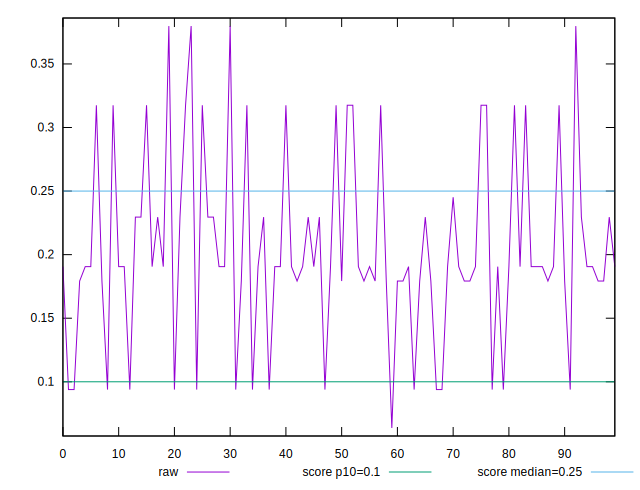
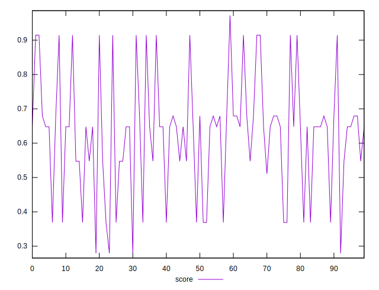

# //cumulative-layout-shift/samples/pages+cached+noadtech

[→ Parent](../..)


## Raw


```yaml
p90min: 0.0938739013671875
p90max: 0.31750728607177736
p90range: 0.22363338470458988
p90mean: 0.1938007492023509
p90median: 0.1905707836151123
p90stdev: 0.06337796774429523
p90skewness: 0.31850751781253084
p90eccentricity: 0.9999999999999984
p90discretization: 15.166666666666666
outlandishness: 1.117689071596426

```


## Score


```yaml
p90min: 0.3690659991228524
p90max: 0.9146517814122077
p90range: 0.5455857822893553
p90mean: 0.6255045436600326
p90median: 0.6478936866255779
p90stdev: 0.15582084596889118
p90skewness: 0.04715454255351977
p90eccentricity: 1.0000000000000002
p90discretization: 15.166666666666666
outlandishness: 1.0037903778953068

```

