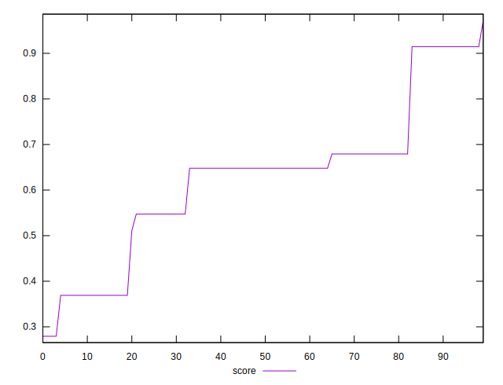
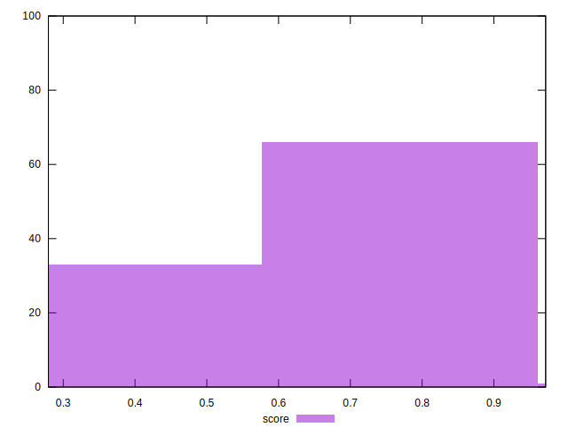

# //cumulative-layout-shift/samples/pages+cached+noadtech

[→ Parent](../..)


## Raw


```yaml
p90min: 0.0636767578125
p90max: 0.31750728607177736
p90range: 0.2538305282592774
p90mean: 0.18960589292314317
p90median: 0.1905707836151123
p90stdev: 0.06238480078954449
p90skewness: 0.26559948360392766
p90eccentricity: 1.0000000000000018
p90discretization: 12.857142857142858
outlandishness: 1.1676918412763264

```


## Score


```yaml
p90min: 0.27931295209719315
p90max: 0.9146517814122077
p90range: 0.6353388293150146
p90mean: 0.5940545152710078
p90median: 0.6478936866255779
p90stdev: 0.1557004545974338
p90skewness: -0.18234210617857016
p90eccentricity: 0.9999999999999992
p90discretization: 12.857142857142858
outlandishness: 1.1128877536749255

```

