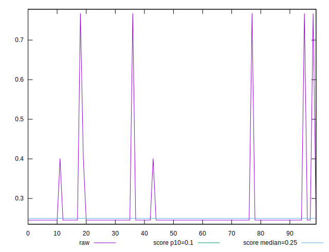
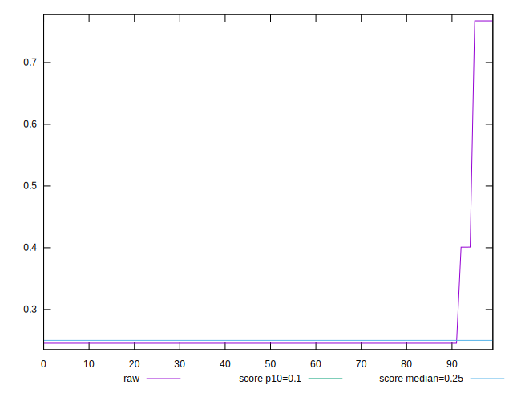
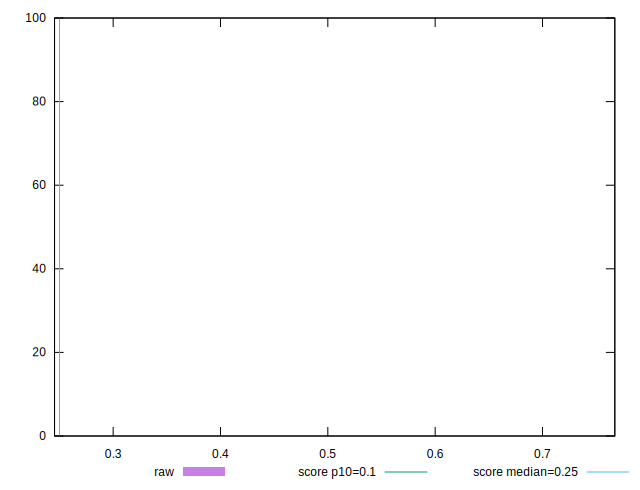
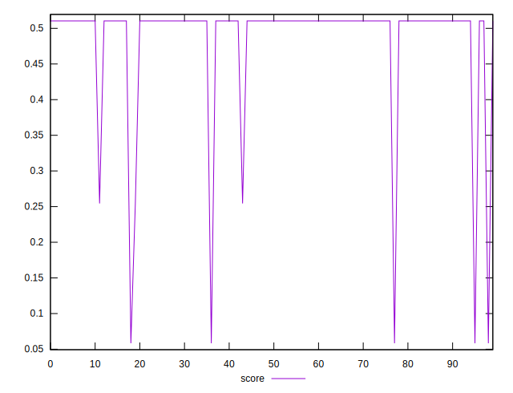
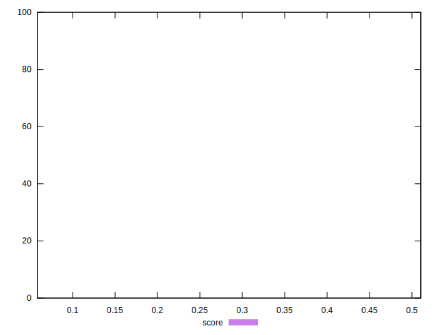

# //cumulative-layout-shift/samples/pages+cached+noexternal+nocss

[→ Parent](../..)


## Raw


```yaml
p90min: 0.24537114122178816
p90max: 0.24537114122178816
p90range: 0
p90mean: 0.2453711412217884
p90median: 0.24537114122178816
p90stdev: 2.498001805406602e-16
p90skewness: -1
p90eccentricity: 1
p90discretization: 91
outlandishness: 1.2665262247764042

```


## Score


```yaml
p90min: 0.5104268062017119
p90max: 0.5104268062017119
p90range: 0
p90mean: 0.5104268062017122
p90median: 0.5104268062017119
p90stdev: 3.3306690738754696e-16
p90skewness: -1
p90eccentricity: 1
p90discretization: 91
outlandishness: 0.884857203051271

```

