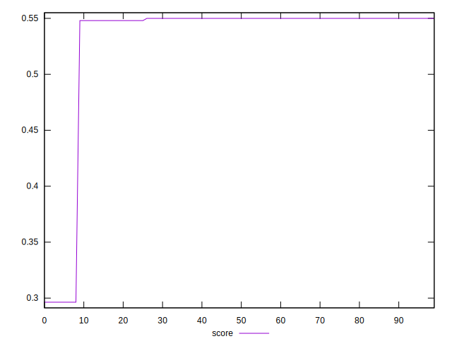

# //cumulative-layout-shift/samples/pages+cached+noexternal+nofonts+nosvg+noimg+nocss

[→ Parent](../..)


## Raw


```yaml
p90min: 0.22853081597222222
p90max: 0.22935199652777777
p90range: 0.0008211805555555507
p90mean: 0.2286842233287543
p90median: 0.22853081597222222
p90stdev: 0.0003200645579024692
p90skewness: 1.6070690421401883
p90eccentricity: 0.9999999999999984
p90discretization: 45.5
outlandishness: 1.111400460323134

```


## Score


```yaml
p90min: 0.5479826726867736
p90max: 0.5499689372766312
p90range: 0.0019862645898576226
p90mean: 0.5495978768587457
p90median: 0.5499689372766312
p90stdev: 0.000774169448520391
p90skewness: -1.6070690421377813
p90eccentricity: 1.0000000000000013
p90discretization: 45.5
outlandishness: 0.9187759412015769

```

