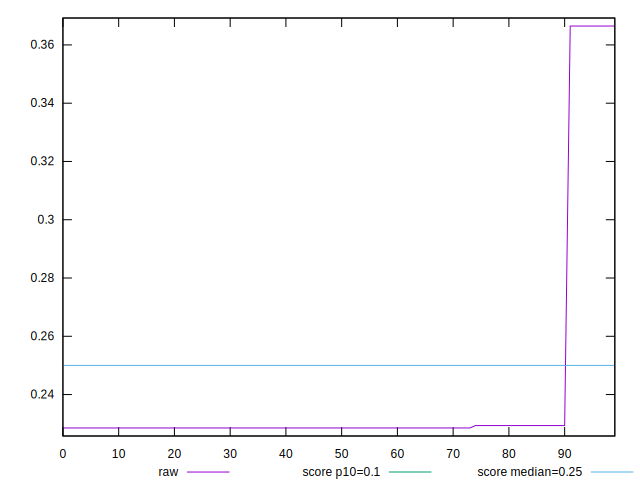
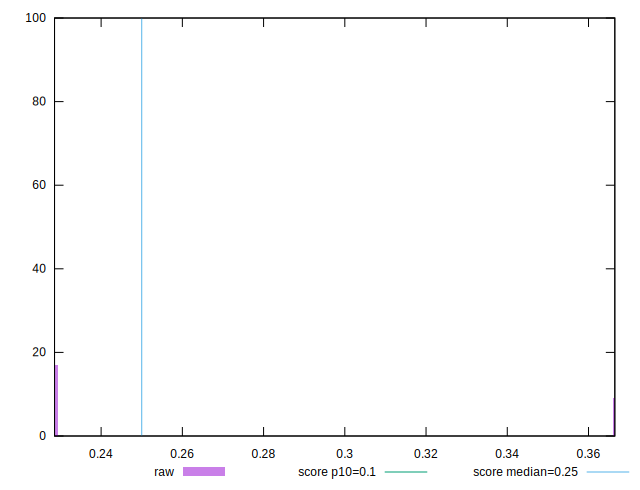
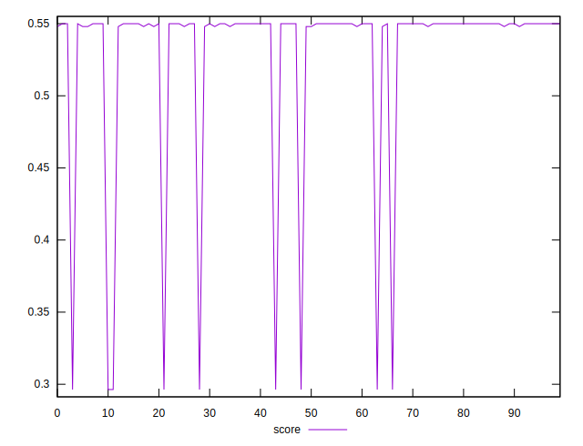

# //cumulative-layout-shift/samples/pages+cached+noexternal+nofonts+nosvg+noimg+nocss

[→ Parent](../..)


## Raw


```yaml
p90min: 0.22853081597222222
p90max: 0.22935199652777777
p90range: 0.0008211805555555507
p90mean: 0.22867680362654344
p90median: 0.22853081597222222
p90stdev: 0.0003139583218604278
p90skewness: 1.6855907617881605
p90eccentricity: 0.9999999999999974
p90discretization: 45
outlandishness: 1.1114725830229608

```


## Score


```yaml
p90min: 0.2963432211283839
p90max: 0.5499689372766312
p90range: 0.2536257161482473
p90mean: 0.5242311823503888
p90median: 0.5499689372766312
p90stdev: 0.07596652929977778
p90skewness: -2.6661580765844954
p90eccentricity: 1.0000000000000009
p90discretization: 30
outlandishness: 1.0098433428163491

```

