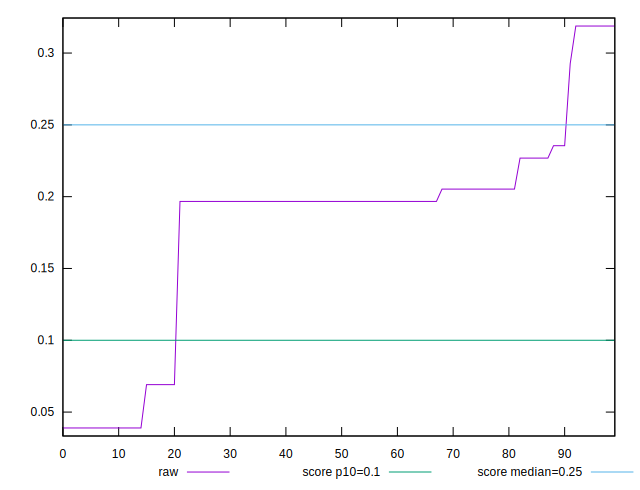
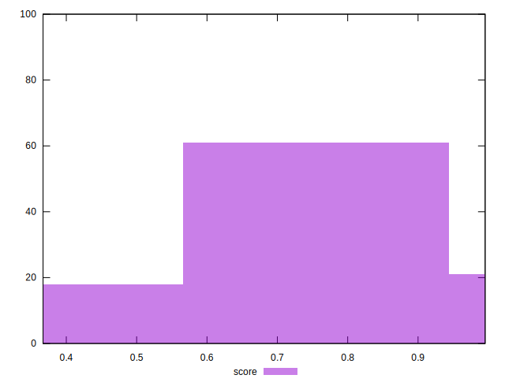

# //cumulative-layout-shift/samples/pages+cached+noexternal+nofonts+nosvg+noimg

[→ Parent](../..)


## Raw


```yaml
p90min: 0.0389404296875
p90max: 0.3188018798828125
p90range: 0.2798614501953125
p90mean: 0.19425067119109327
p90median: 0.19667434692382812
p90stdev: 0.06512058559986926
p90skewness: -0.6915666811612459
p90eccentricity: 0.9999999999999992
p90discretization: 11.375
outlandishness: 0.8612616485956838

```


## Score


```yaml
p90min: 0.36692102630185863
p90max: 0.9953476174851198
p90range: 0.6284265911832612
p90mean: 0.6398186593879689
p90median: 0.6313938914065288
p90stdev: 0.15303034011333738
p90skewness: 0.8944110891868651
p90eccentricity: 1.0000000000000016
p90discretization: 11.375
outlandishness: 1.102521902947064

```

