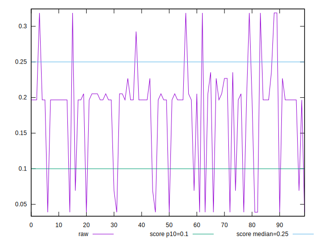

# //cumulative-layout-shift/samples/pages+cached+noexternal+nofonts+nosvg+noimg

[→ Parent](../..)


## Raw


```yaml
p90min: 0.0389404296875
p90max: 0.23547510782877604
p90range: 0.19653467814127604
p90mean: 0.1660966316505715
p90median: 0.19667434692382812
p90stdev: 0.06634609720879413
p90skewness: -1.221579035602262
p90eccentricity: 0.9999999999999996
p90discretization: 15
outlandishness: 1.1779816204952167

```


## Score


```yaml
p90min: 0.36692102630185863
p90max: 0.9953476174851198
p90range: 0.6284265911832612
p90mean: 0.6358683376313338
p90median: 0.6313938914065288
p90stdev: 0.1491925914432455
p90skewness: 0.9050382148673525
p90eccentricity: 1
p90discretization: 11.25
outlandishness: 1.1162632536881418

```

