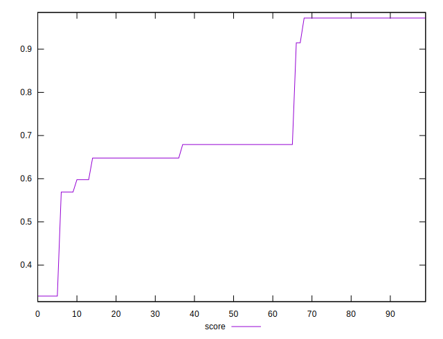

# //cumulative-layout-shift/samples/pages+cached+noexternal+nofonts

[→ Parent](../..)


## Raw


```yaml
p90min: 0.0636767578125
p90max: 0.2207679271697998
p90range: 0.15709116935729978
p90mean: 0.1465455360202999
p90median: 0.17922065734863282
p90stdev: 0.059122456161502135
p90skewness: -0.5951037692107168
p90eccentricity: 1.0000000000000022
p90discretization: 15.166666666666666
outlandishness: 1.1315088890579885

```


## Score


```yaml
p90min: 0.5690350599985126
p90max: 0.9721147685558164
p90range: 0.4030797085573038
p90mean: 0.7613966062381186
p90median: 0.6792219852973744
p90stdev: 0.1512510702057868
p90skewness: 0.5806564228827038
p90eccentricity: 1.0000000000000002
p90discretization: 15.166666666666666
outlandishness: 0.9489993367886187

```


## P Score


```yaml
p90min: 0.5690350599985126
p90max: 0.9721147685558164
p90range: 0.4030797085573038
p90mean: 0.7613966062381186
p90median: 0.6792219852973744
p90stdev: 0.1512510702057868
p90skewness: 0.5806564228827038
p90eccentricity: 1.0000000000000002
p90discretization: 15.166666666666666
outlandishness: 0.9489993367886187

```


## Score Difference


```yaml
p90min: -0.002114768555816382
p90max: 0.0021683223201357515
p90range: 0.0042830908759521336
p90mean: 0.0004553912972896499
p90median: 0.0007780147026256179
p90stdev: 0.0016719703732728682
p90skewness: -0.6698912799932292
p90eccentricity: 1.000000000000001
p90discretization: 15.166666666666666
outlandishness: 0.14488097537740693

```


## P Score Difference


```yaml
p90min: 0
p90max: 0
p90range: 0
p90mean: 0
p90median: 0
p90stdev: 0
p90skewness: .nan
p90eccentricity: .nan
p90discretization: 91
outlandishness: .nan

```

