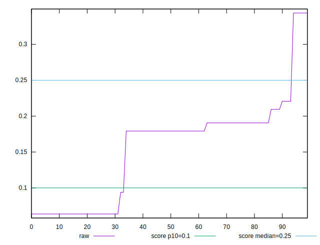
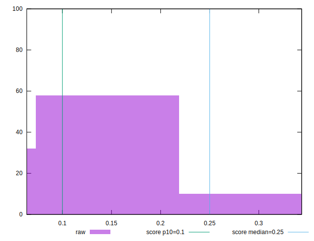

# //cumulative-layout-shift/samples/pages+cached+noexternal+nofonts

[→ Parent](../..)


## Raw


```yaml
p90min: 0.0636767578125
p90max: 0.2207679271697998
p90range: 0.15709116935729978
p90mean: 0.14654553602029993
p90median: 0.17922065734863282
p90stdev: 0.05912245616150214
p90skewness: -0.5951037692107167
p90eccentricity: 1.000000000000002
p90discretization: 15.166666666666666
outlandishness: 1.131508889057988

```


## Score


```yaml
p90min: 0.5690350599985126
p90max: 0.9721147685558164
p90range: 0.4030797085573038
p90mean: 0.7613966062381188
p90median: 0.6792219852973744
p90stdev: 0.1512510702057868
p90skewness: 0.580656422882708
p90eccentricity: 1.0000000000000004
p90discretization: 15.166666666666666
outlandishness: 0.948999336788618

```

