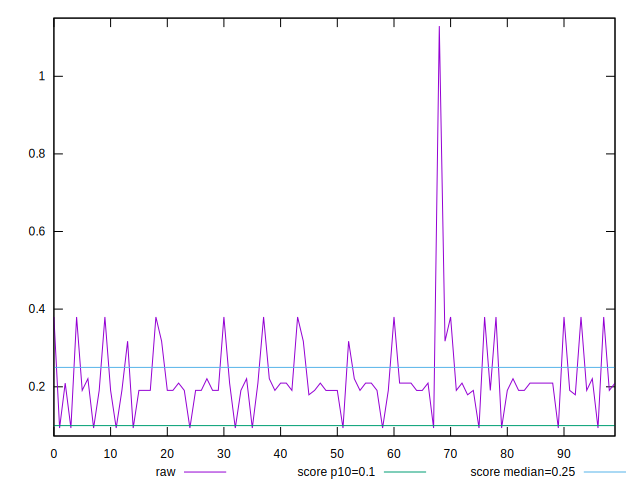
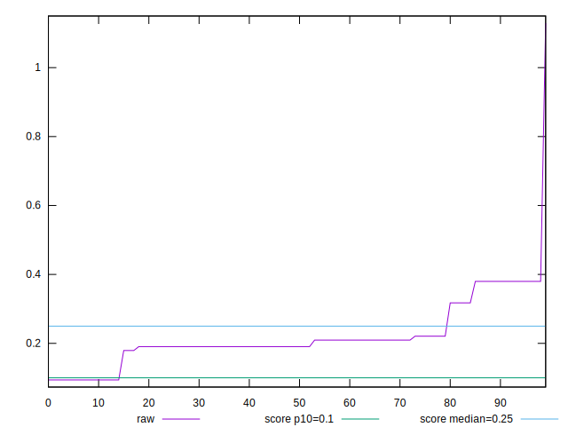
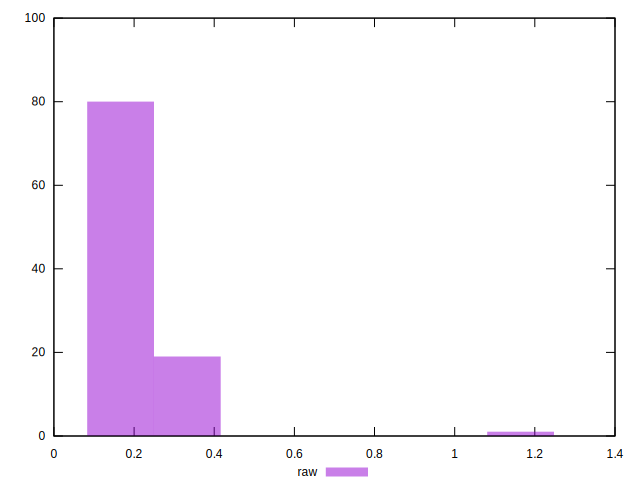
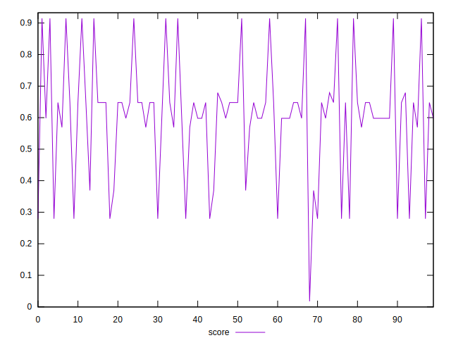
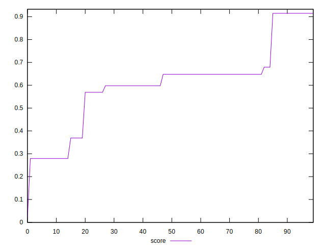
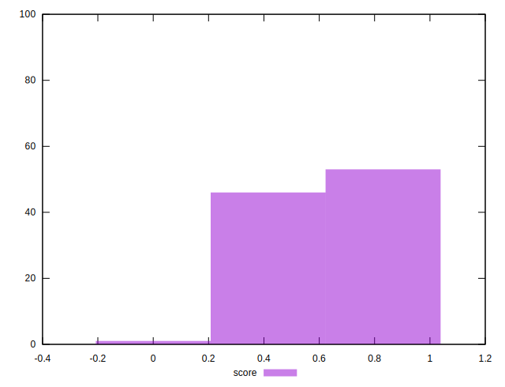

# //cumulative-layout-shift/samples/pages+cached+noexternal+noimg

[→ Parent](../..)


## Raw


```yaml
p90min: 0.0938739013671875
p90max: 0.3797997665405274
p90range: 0.2859258651733399
p90mean: 0.19817794100443537
p90median: 0.1905707836151123
p90stdev: 0.06737311345258695
p90skewness: 0.7812674420022383
p90eccentricity: 0.999999999999999
p90discretization: 12.857142857142858
outlandishness: 1.275674393229224

```


## Score


```yaml
p90min: 0.017481246450500643
p90max: 0.9146517814122077
p90range: 0.8971705349617071
p90mean: 0.5666697271095641
p90median: 0.5978316776798642
p90stdev: 0.16821638431878502
p90skewness: -0.705155593564204
p90eccentricity: 1.0000000000000002
p90discretization: 11.25
outlandishness: 1.1265875074844118

```

