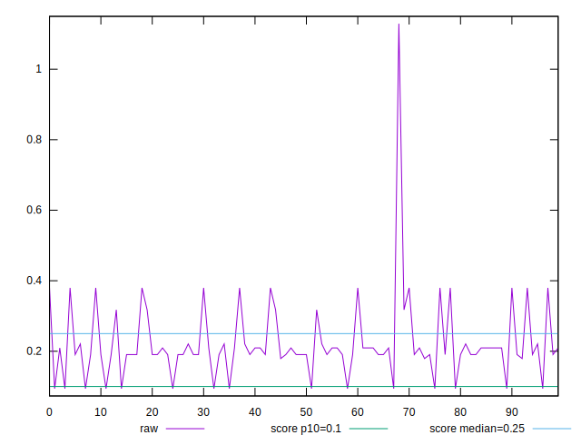
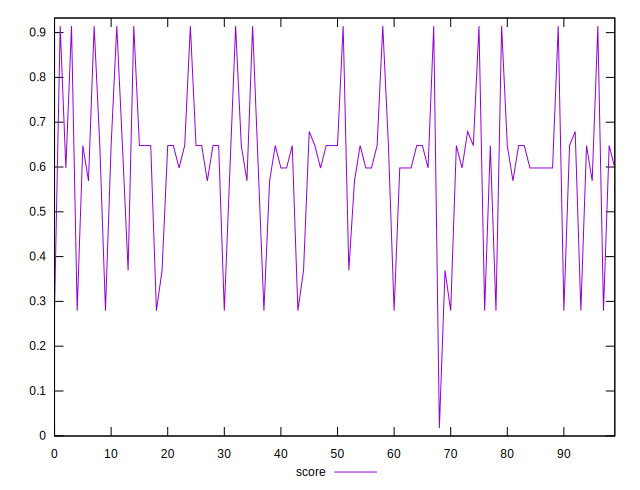
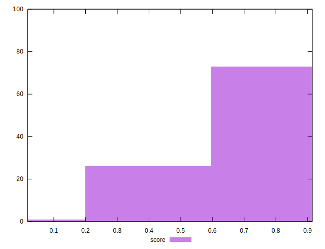

# //cumulative-layout-shift/samples/pages+cached+noexternal+noimg

[→ Parent](../..)


## Raw


```yaml
p90min: 0.0938739013671875
p90max: 0.3797997665405274
p90range: 0.2859258651733399
p90mean: 0.2001737852410956
p90median: 0.1905707836151123
p90stdev: 0.06962586642812282
p90skewness: 0.8091147623570506
p90eccentricity: 0.9999999999999989
p90discretization: 13
outlandishness: 1.2503628408039487

```


## Score


```yaml
p90min: 0.27931295209719315
p90max: 0.9146517814122077
p90range: 0.6353388293150146
p90mean: 0.63620668561269
p90median: 0.6478936866255779
p90stdev: 0.16088365525626416
p90skewness: -0.12457147616207916
p90eccentricity: 1.0000000000000018
p90discretization: 13
outlandishness: 0.8937756082168797

```


## P Score


```yaml
p90min: 0.27931295209719315
p90max: 0.9146517814122077
p90range: 0.6353388293150146
p90mean: 0.63620668561269
p90median: 0.6478936866255779
p90stdev: 0.16088365525626416
p90skewness: -0.12457147616207916
p90eccentricity: 1.0000000000000018
p90discretization: 13
outlandishness: 0.8937756082168797

```


## Score Difference


```yaml
p90min: -0.004651781412207678
p90max: 0.002518753549499358
p90range: 0.007170534961707036
p90mean: 0.001264536029967766
p90median: 0.0021063133744221307
p90stdev: 0.001687968810097013
p90skewness: -2.7608847078389687
p90eccentricity: 0.9999999999999999
p90discretization: 11.375
outlandishness: 0.3351504372736069

```


## P Score Difference


```yaml
p90min: 0
p90max: 0
p90range: 0
p90mean: 0
p90median: 0
p90stdev: 0
p90skewness: .nan
p90eccentricity: .nan
p90discretization: 91
outlandishness: .nan

```

