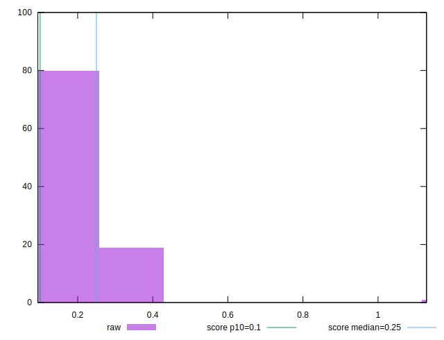

# //cumulative-layout-shift/samples/pages+cached+noexternal+noimg

[→ Parent](../..)


## Raw


```yaml
p90min: 0.0938739013671875
p90max: 0.3797997665405274
p90range: 0.2859258651733399
p90mean: 0.20017378524109553
p90median: 0.1905707836151123
p90stdev: 0.06962586642812281
p90skewness: 0.8091147623570474
p90eccentricity: 0.9999999999999981
p90discretization: 13
outlandishness: 1.25036284080395

```


## Score


```yaml
p90min: 0.27931295209719315
p90max: 0.9146517814122077
p90range: 0.6353388293150146
p90mean: 0.63620668561269
p90median: 0.6478936866255779
p90stdev: 0.16088365525626422
p90skewness: -0.12457147616207917
p90eccentricity: 1.0000000000000013
p90discretization: 13
outlandishness: 0.8937756082168797

```

