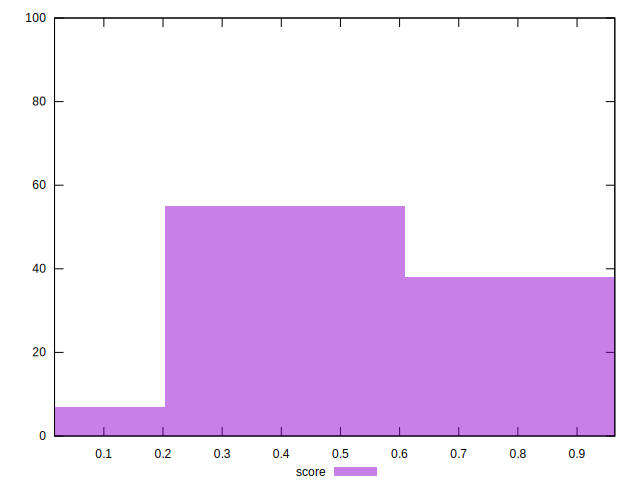

# //cumulative-layout-shift/samples/pages+cached+noexternal+nosvg

[→ Parent](../..)


## Raw


```yaml
p90min: 0.0691375732421875
p90max: 0.29268795013427734
p90range: 0.22355037689208984
p90mean: 0.1846510878063384
p90median: 0.20527796427408854
p90stdev: 0.06392863831016928
p90skewness: -1.0224694532788918
p90eccentricity: 0.9999999999999997
p90discretization: 15.166666666666666
outlandishness: 1.8279605002807542

```


## Score


```yaml
p90min: 0.4127453832736135
p90max: 0.9638914552234408
p90range: 0.5511460719498273
p90mean: 0.664209711241856
p90median: 0.6085969600017687
p90stdev: 0.1646733395618452
p90skewness: 1.0868935999812062
p90eccentricity: 1.0000000000000013
p90discretization: 15.166666666666666
outlandishness: 0.8850528686622017

```


## P Score


```yaml
p90min: 0.4127453832736135
p90max: 0.9638914552234408
p90range: 0.5511460719498273
p90mean: 0.664209711241856
p90median: 0.6085969600017687
p90stdev: 0.1646733395618452
p90skewness: 1.0868935999812062
p90eccentricity: 1.0000000000000013
p90discretization: 15.166666666666666
outlandishness: 0.8850528686622017

```


## Score Difference


```yaml
p90min: -0.0040004695589968
p90max: 0.0014030399982313257
p90range: 0.0054035095572281255
p90mean: -0.0024579419060679368
p90median: -0.0038914552234408095
p90stdev: 0.002080645140013234
p90skewness: 0.9939133187477495
p90eccentricity: 1.0000000000000002
p90discretization: 15.166666666666666
outlandishness: 0.6425197858368936

```


## P Score Difference


```yaml
p90min: 0
p90max: 0
p90range: 0
p90mean: 0
p90median: 0
p90stdev: 0
p90skewness: .nan
p90eccentricity: .nan
p90discretization: 91
outlandishness: .nan

```

