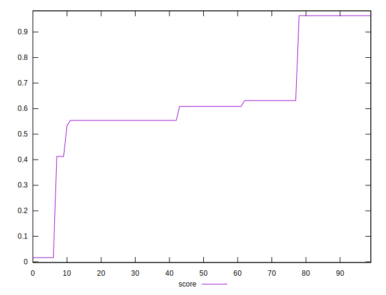

# //cumulative-layout-shift/samples/pages+cached+noexternal+nosvg

[→ Parent](../..)


## Raw


```yaml
p90min: 0.0691375732421875
p90max: 0.23547510782877604
p90range: 0.16633753458658854
p90mean: 0.1784828920717593
p90median: 0.20527796427408854
p90stdev: 0.0632588946935643
p90skewness: -1.074920874668093
p90eccentricity: 0.9999999999999982
p90discretization: 18
outlandishness: 1.956488767977202

```


## Score


```yaml
p90min: 0.01659363310226647
p90max: 0.9638914552234408
p90range: 0.9472978221211743
p90mean: 0.5872011945881912
p90median: 0.6085969600017687
p90stdev: 0.21476912568520304
p90skewness: -0.756841731022019
p90eccentricity: 0.9999999999999992
p90discretization: 12.857142857142858
outlandishness: 1.1324154741502919

```

