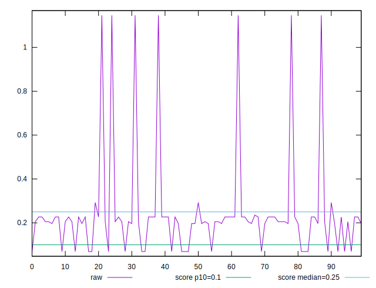
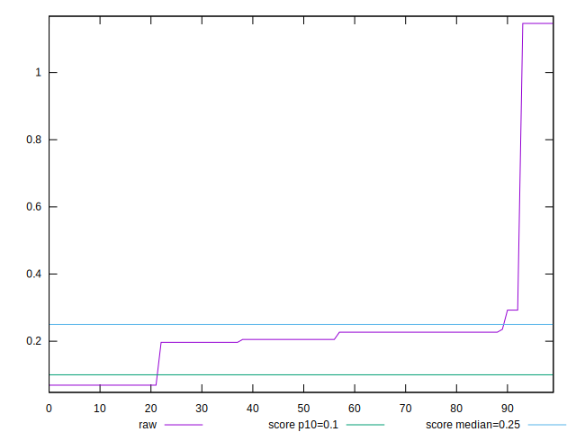
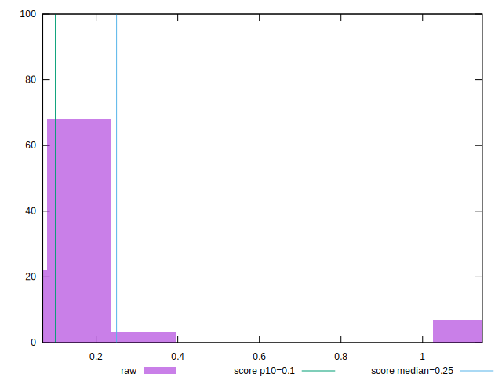

# //cumulative-layout-shift/samples/pages+cached+noexternal+nosvg

[→ Parent](../..)


## Raw


```yaml
p90min: 0.0691375732421875
p90max: 0.29268795013427734
p90range: 0.22355037689208984
p90mean: 0.1846510878063384
p90median: 0.20527796427408854
p90stdev: 0.06392863831016928
p90skewness: -1.022469453278891
p90eccentricity: 0.9999999999999992
p90discretization: 15.166666666666666
outlandishness: 1.8279605002807542

```


## Score


```yaml
p90min: 0.4127453832736135
p90max: 0.9638914552234408
p90range: 0.5511460719498273
p90mean: 0.6642097112418561
p90median: 0.6085969600017687
p90stdev: 0.1646733395618452
p90skewness: 1.086893599981206
p90eccentricity: 1.000000000000001
p90discretization: 15.166666666666666
outlandishness: 0.8850528686622012

```

