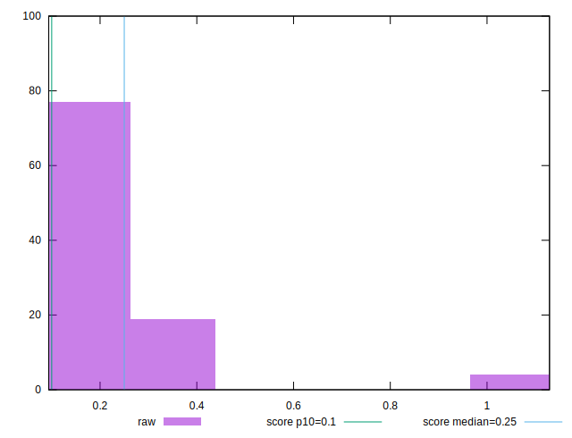
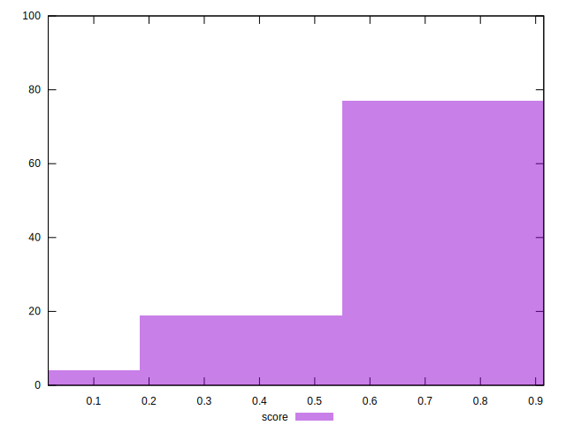

# //cumulative-layout-shift/samples/pages+cached+noexternal

[→ Parent](../..)


## Raw


```yaml
p90min: 0.0938739013671875
p90max: 0.3797997665405274
p90range: 0.2859258651733399
p90mean: 0.22816254804422564
p90median: 0.20941780090332032
p90stdev: 0.07116560295873732
p90skewness: 1.0394747446506445
p90eccentricity: 1.0000000000000007
p90discretization: 11.375
outlandishness: 1.2735713480821766

```


## Score


```yaml
p90min: 0.27931295209719315
p90max: 0.9146517814122077
p90range: 0.6353388293150146
p90mean: 0.5704815441383448
p90median: 0.5978316776798642
p90stdev: 0.14853447903268566
p90skewness: -0.5416405033520382
p90eccentricity: 1.0000000000000002
p90discretization: 11.375
outlandishness: 0.9828553348446573

```

