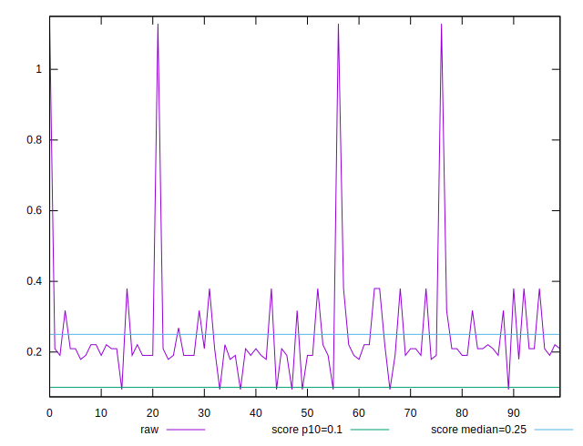
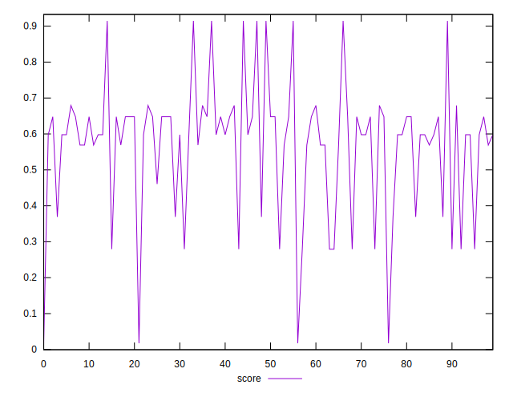
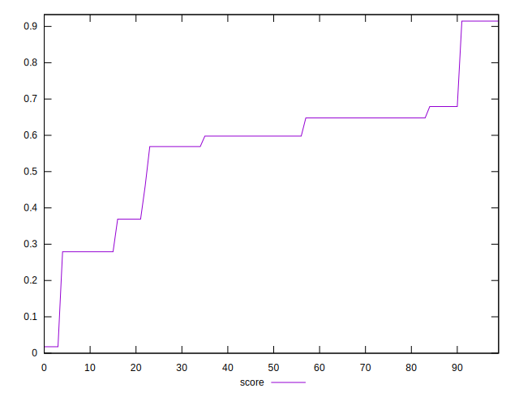

# //cumulative-layout-shift/samples/pages+cached+noexternal

[→ Parent](../..)


## Raw


```yaml
p90min: 0.0938739013671875
p90max: 0.3797997665405274
p90range: 0.2859258651733399
p90mean: 0.2105929197735258
p90median: 0.20941780090332032
p90stdev: 0.06542979941198789
p90skewness: 0.8671582664432175
p90eccentricity: 1
p90discretization: 11.25
outlandishness: 1.4949424174228627

```


## Score


```yaml
p90min: 0.017481246450500643
p90max: 0.6792219852973744
p90range: 0.6617407388468738
p90mean: 0.5293990710160578
p90median: 0.5978316776798642
p90stdev: 0.16975104921027245
p90skewness: -1.5366113732731745
p90eccentricity: 0.9999999999999974
p90discretization: 11.25
outlandishness: 1.1413174239681132

```

