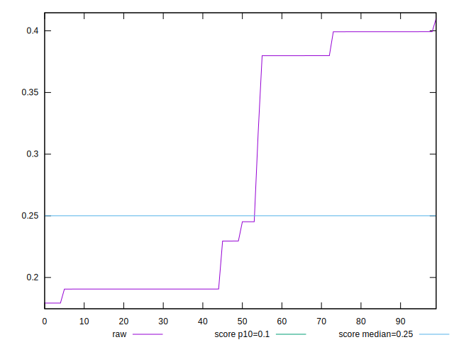
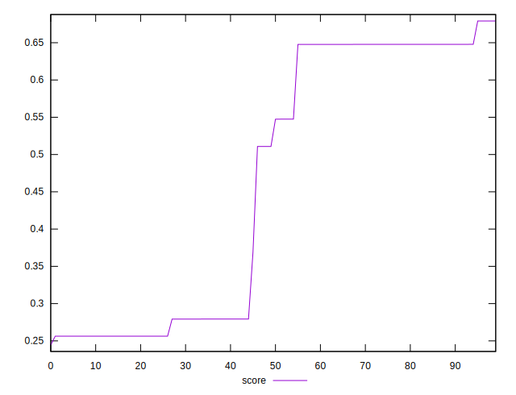

# //cumulative-layout-shift/samples/pages+cached+nointeractive

[→ Parent](../..)


## Raw


```yaml
p90min: 0.1792506052652995
p90max: 0.3992685298919677
p90range: 0.2200179246266682
p90mean: 0.2746226672637157
p90median: 0.2295603162977431
p90stdev: 0.09505118980837376
p90skewness: 0.34913378208369317
p90eccentricity: 0.9999999999999999
p90discretization: 1.8958333333333333
outlandishness: 1.0841946003062615

```


## Score


```yaml
p90min: 0.2562666365089175
p90max: 0.6478431386284664
p90range: 0.3915765021195489
p90mean: 0.46134863358104794
p90median: 0.5108405889204024
p90stdev: 0.18185793413901322
p90skewness: -0.08194214086430777
p90eccentricity: 0.9999999999999991
p90discretization: 1.8958333333333333
outlandishness: 1.0111637594410832

```

