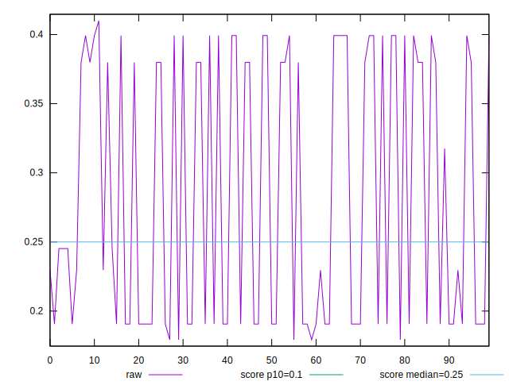
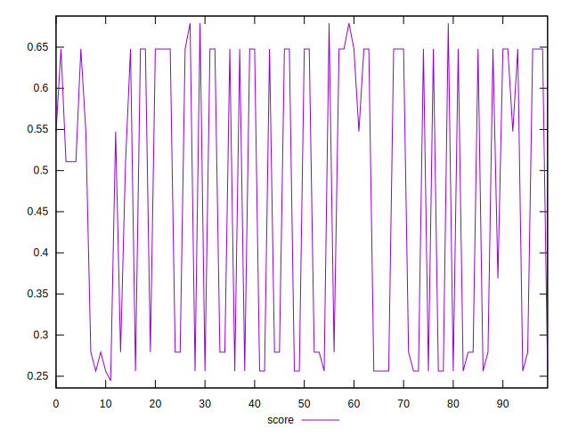

# //cumulative-layout-shift/samples/pages+cached+nointeractive

[→ Parent](../..)


## Raw


```yaml
p90min: 0.1792506052652995
p90max: 0.3992684213850233
p90range: 0.22001781611972376
p90mean: 0.27323771323451296
p90median: 0.21009897009531664
p90stdev: 0.09466027504143731
p90skewness: 0.37593199530467086
p90eccentricity: 1.0000000000000009
p90discretization: 1.9148936170212767
outlandishness: 1.095213321870655

```


## Score


```yaml
p90min: 0.24447509805739986
p90max: 0.6478262898091901
p90range: 0.40335119175179024
p90mean: 0.4417426548621001
p90median: 0.32415536053103766
p90stdev: 0.18179115357870673
p90skewness: 0.11516524668829252
p90eccentricity: 1.000000000000001
p90discretization: 1.836734693877551
outlandishness: 1.1029131106416468

```

