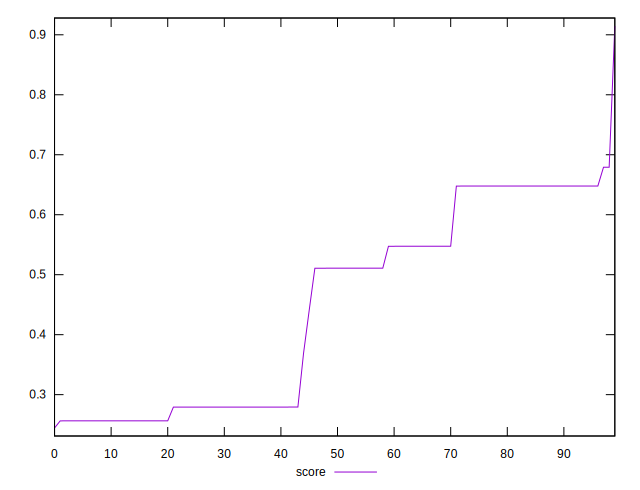

# //cumulative-layout-shift/samples/pages+cached

[→ Parent](../..)


## Raw


```yaml
p90min: 0.09390384928385416
p90max: 0.39926581721835663
p90range: 0.3053619679345025
p90mean: 0.27860121203293026
p90median: 0.2451904294755724
p90stdev: 0.08793518634863597
p90skewness: 0.2510726282523051
p90eccentricity: 0.9999999999999999
p90discretization: 1.836734693877551
outlandishness: 1.0893111520691667

```


## Score


```yaml
p90min: 0.24444197763032915
p90max: 0.6478194912354696
p90range: 0.4033775136051404
p90mean: 0.42357831826130926
p90median: 0.4048932826084083
p90stdev: 0.16029166603447273
p90skewness: 0.20776646631870616
p90eccentricity: 1
p90discretization: 1.8
outlandishness: 1.125119971376074

```

