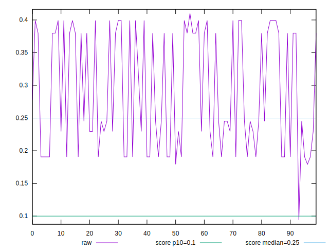
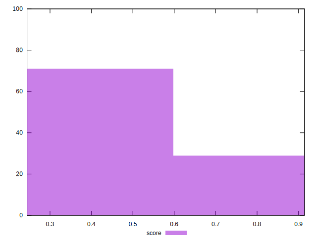

# //cumulative-layout-shift/samples/pages+cached

[→ Parent](../..)


## Raw


```yaml
p90min: 0.19059552319844564
p90max: 0.3992684213850233
p90range: 0.20867289818657764
p90mean: 0.2881183075817513
p90median: 0.24519438997904464
p90stdev: 0.08720826892151652
p90skewness: 0.17920778497300108
p90eccentricity: 1
p90discretization: 1.9361702127659575
outlandishness: 1.0185356692652305

```


## Score


```yaml
p90min: 0.2562630880677941
p90max: 0.6478262898091901
p90range: 0.391563201741396
p90mean: 0.4304753178558181
p90median: 0.5107702446850244
p90stdev: 0.1616046248998375
p90skewness: 0.14609211089510077
p90eccentricity: 0.9999999999999999
p90discretization: 1.7843137254901962
outlandishness: 1.0893558410009658

```

