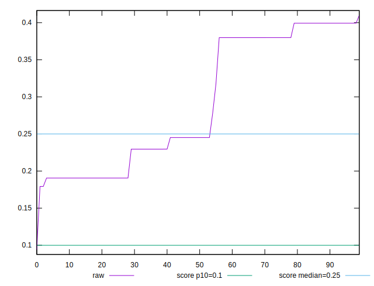
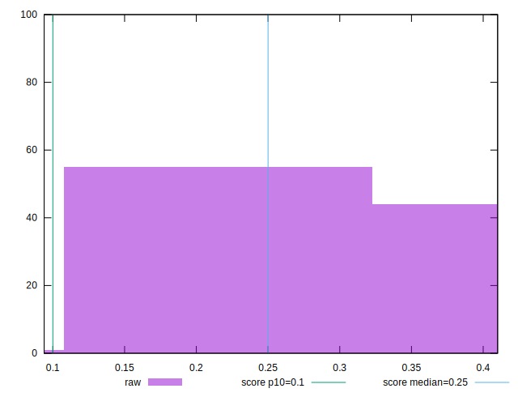

# //cumulative-layout-shift/samples/pages+cached

[→ Parent](../..)


## Raw


```yaml
p90min: 0.19059552319844564
p90max: 0.3992684213850233
p90range: 0.20867289818657764
p90mean: 0.2881183075817513
p90median: 0.24519438997904464
p90stdev: 0.08720826892151652
p90skewness: 0.17920778497300108
p90eccentricity: 1
p90discretization: 1.9361702127659575
outlandishness: 1.0185356692652305

```


## Score


```yaml
p90min: 0.2562630880677941
p90max: 0.6478262898091901
p90range: 0.391563201741396
p90mean: 0.430475317855818
p90median: 0.5107702446850244
p90stdev: 0.16160462489983748
p90skewness: 0.14609211089510085
p90eccentricity: 1.0000000000000002
p90discretization: 1.7843137254901962
outlandishness: 1.0893558410009663

```


## P Score


```yaml
p90min: 0.2562630880677941
p90max: 0.6478262898091901
p90range: 0.391563201741396
p90mean: 0.430475317855818
p90median: 0.5107702446850244
p90stdev: 0.16160462489983748
p90skewness: 0.14609211089510085
p90eccentricity: 1.0000000000000002
p90discretization: 1.7843137254901962
outlandishness: 1.0893558410009663

```


## Score Difference


```yaml
p90min: -0.0008287408726042056
p90max: 0.003736911932205933
p90range: 0.004565652804810139
p90mean: 0.0019254745799176106
p90median: 0.0021805087645304644
p90stdev: 0.0013152101215318755
p90skewness: -0.3391428344202444
p90eccentricity: 0.9999999999999999
p90discretization: 1.7843137254901962
outlandishness: 0.6934331029381754

```


## P Score Difference


```yaml
p90min: 0
p90max: 0
p90range: 0
p90mean: 0
p90median: 0
p90stdev: 0
p90skewness: .nan
p90eccentricity: .nan
p90discretization: 91
outlandishness: .nan

```

