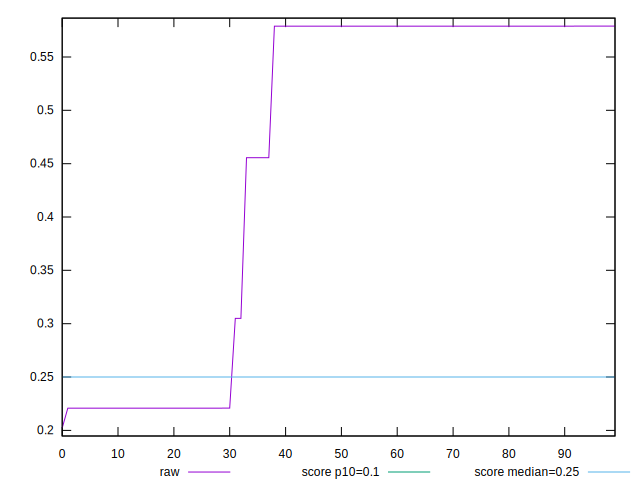
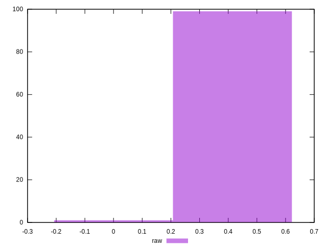
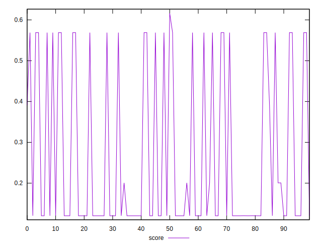
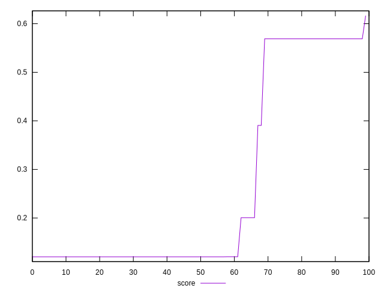
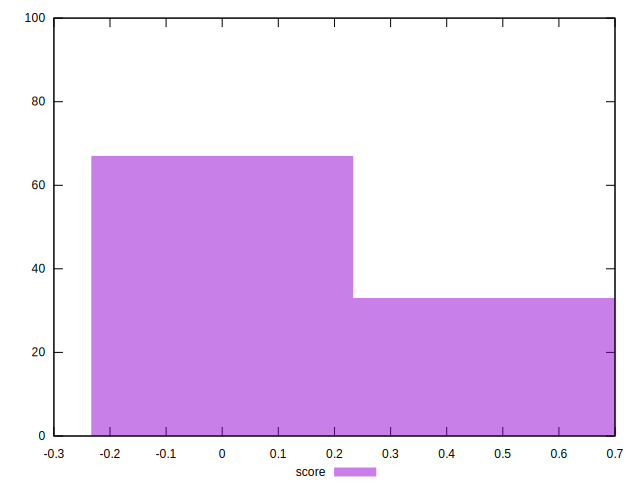

# //cumulative-layout-shift/samples/pages

[→ Parent](../..)


## Raw


```yaml
p90min: 0.20224875195821124
p90max: 0.5789013245900472
p90range: 0.37665257263183594
p90mean: 0.4424071816526813
p90median: 0.5788870016733805
p90stdev: 0.16793481822165943
p90skewness: -0.5003767569552005
p90eccentricity: 1.0000000000000013
p90discretization: 2.5
outlandishness: 1.0626615089393523

```


## Score


```yaml
p90min: 0.12011090399475044
p90max: 0.5689518661631368
p90range: 0.4488409621683863
p90mean: 0.2353271482195068
p90median: 0.12012538774702203
p90stdev: 0.18897848751927224
p90skewness: 1.1394666198930408
p90eccentricity: 1.0000000000000002
p90discretization: 2.142857142857143
outlandishness: 1.3082653368359167

```

