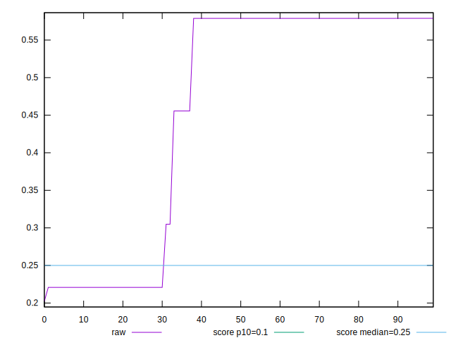
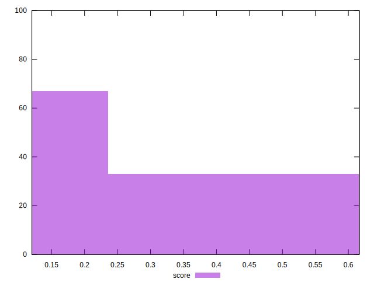

# //cumulative-layout-shift/samples/pages

[→ Parent](../..)


## Raw


```yaml
p90min: 0.22080134730868867
p90max: 0.5789194452497695
p90range: 0.3581180979410808
p90mean: 0.47952857976547786
p90median: 0.5788894973331027
p90stdev: 0.15365767351848364
p90skewness: -1.0021803453402207
p90eccentricity: 0.9999999999999996
p90discretization: 2.1666666666666665
outlandishness: 0.9045035891874187

```


## Score


```yaml
p90min: 0.12011090399475044
p90max: 0.5689518661631368
p90range: 0.4488409621683863
p90mean: 0.23899335391119522
p90median: 0.12012538774702203
p90stdev: 0.1911285311344752
p90skewness: 1.0902330725081422
p90eccentricity: 1.0000000000000002
p90discretization: 2.1666666666666665
outlandishness: 1.2684350979474155

```

