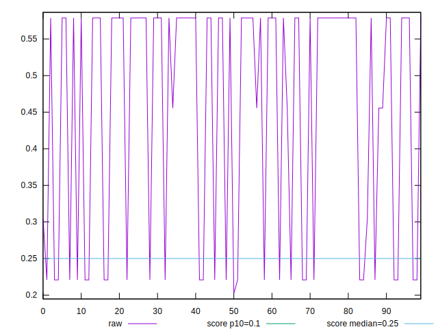

# //cumulative-layout-shift/samples/pages

[→ Parent](../..)


## Raw


```yaml
p90min: 0.22080134730868867
p90max: 0.5789194452497695
p90range: 0.3581180979410808
p90mean: 0.47952857976547786
p90median: 0.5788894973331027
p90stdev: 0.15365767351848367
p90skewness: -1.0021803453402205
p90eccentricity: 0.9999999999999986
p90discretization: 2.1666666666666665
outlandishness: 0.9045035891874187

```


## Score


```yaml
p90min: 0.12011090399475044
p90max: 0.5689518661631368
p90range: 0.4488409621683863
p90mean: 0.2389933539111952
p90median: 0.12012538774702203
p90stdev: 0.19112853113447523
p90skewness: 1.0902330725081404
p90eccentricity: 1.0000000000000007
p90discretization: 2.1666666666666665
outlandishness: 1.2684350979474155

```


## P Score


```yaml
p90min: 0.12011090399475044
p90max: 0.5689518661631368
p90range: 0.4488409621683863
p90mean: 0.2389933539111952
p90median: 0.12012538774702203
p90stdev: 0.19112853113447523
p90skewness: 1.0902330725081404
p90eccentricity: 1.0000000000000007
p90discretization: 2.1666666666666665
outlandishness: 1.2684350979474155

```


## Score Difference


```yaml
p90min: -0.0006004812642350088
p90max: 0.0010929681196130137
p90range: 0.0016934493838480225
p90mean: 0.0002180721132202209
p90median: -0.00012113687531878359
p90stdev: 0.0005522745160734929
p90skewness: 0.8259073708453647
p90eccentricity: 1
p90discretization: 2.4594594594594597
outlandishness: 1.1529476375356515

```


## P Score Difference


```yaml
p90min: 0
p90max: 0
p90range: 0
p90mean: 0
p90median: 0
p90stdev: 0
p90skewness: .nan
p90eccentricity: .nan
p90discretization: 91
outlandishness: .nan

```

