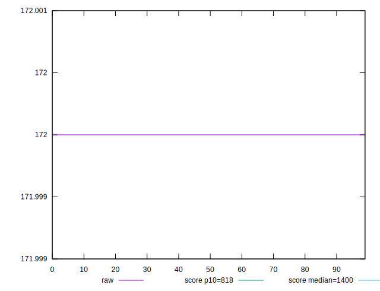
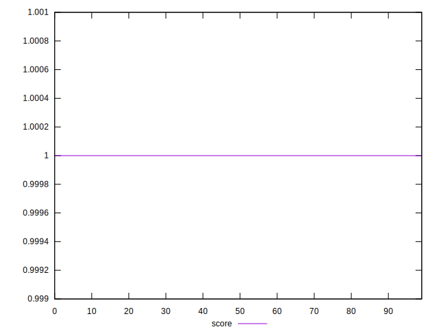
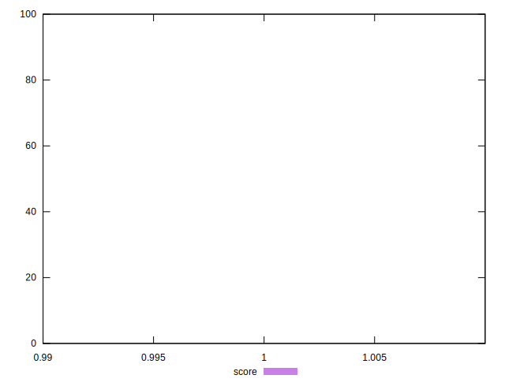

# //dom-size/samples/pages+cached+noexternal+nofonts

[→ Parent](../..)


## Raw


```yaml
p90min: 172
p90max: 172
p90range: 0
p90mean: 172
p90median: 172
p90stdev: 0
p90skewness: .nan
p90eccentricity: .nan
p90discretization: 90
outlandishness: 1

```


## Score


```yaml
p90min: 0.9999997135746177
p90max: 0.9999997135746177
p90range: 0
p90mean: 0.999999713574619
p90median: 0.9999997135746177
p90stdev: 1.3322676295501878e-15
p90skewness: -1
p90eccentricity: 1
p90discretization: 90
outlandishness: 1.0000000000000013

```

