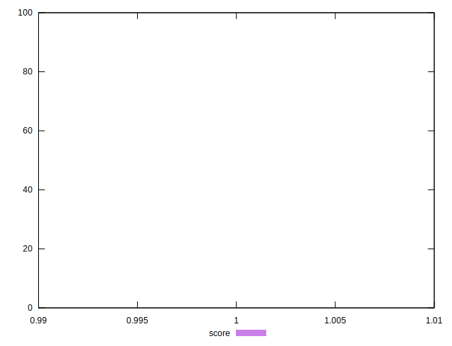

# //dom-size/samples/pages+cached+noexternal+nojs

[→ Parent](../..)


## Raw


```yaml
p90min: 59
p90max: 59
p90range: 0
p90mean: 59
p90median: 59
p90stdev: 0
p90skewness: .nan
p90eccentricity: .nan
p90discretization: 91
outlandishness: 1

```


## Score


```yaml
p90min: 0.9999999999999785
p90max: 0.9999999999999785
p90range: 0
p90mean: 0.9999999999999766
p90median: 0.9999999999999785
p90stdev: 1.887379141862766e-15
p90skewness: 1
p90eccentricity: 1
p90discretization: 91
outlandishness: 0.9999999999999991

```

