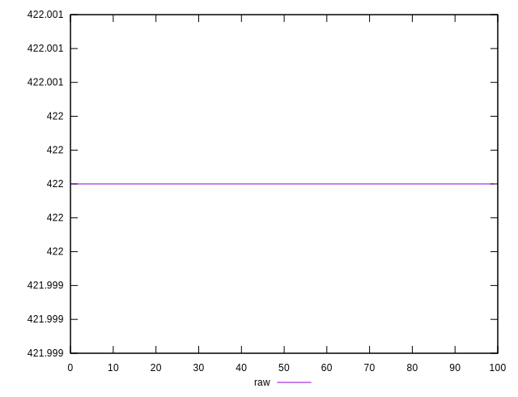
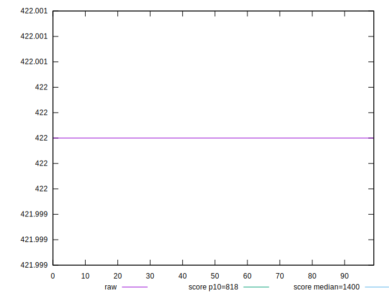
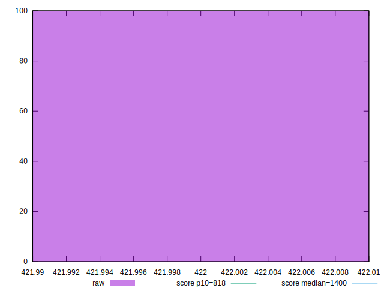
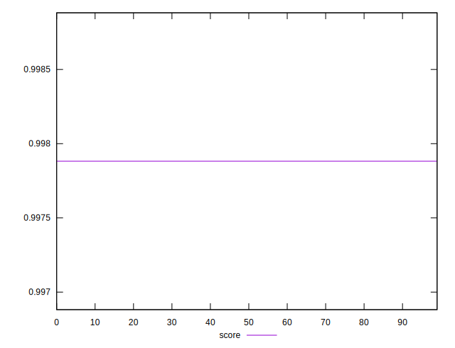
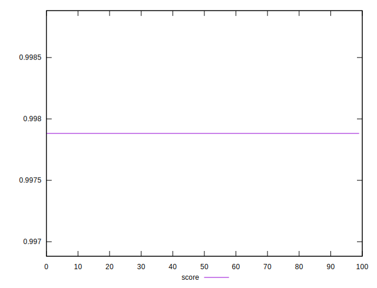

# //dom-size/samples/pages+cached+nointeractive

[→ Parent](../..)


## Raw


```yaml
p90min: 422
p90max: 422
p90range: 0
p90mean: 422
p90median: 422
p90stdev: 0
p90skewness: .nan
p90eccentricity: .nan
p90discretization: 91
outlandishness: 1

```


## Score


```yaml
p90min: 0.9978817385378554
p90max: 0.9978817385378554
p90range: 0
p90mean: 0.9978817385378561
p90median: 0.9978817385378554
p90stdev: 6.661338147750939e-16
p90skewness: -1
p90eccentricity: 1
p90discretization: 91
outlandishness: 1

```

