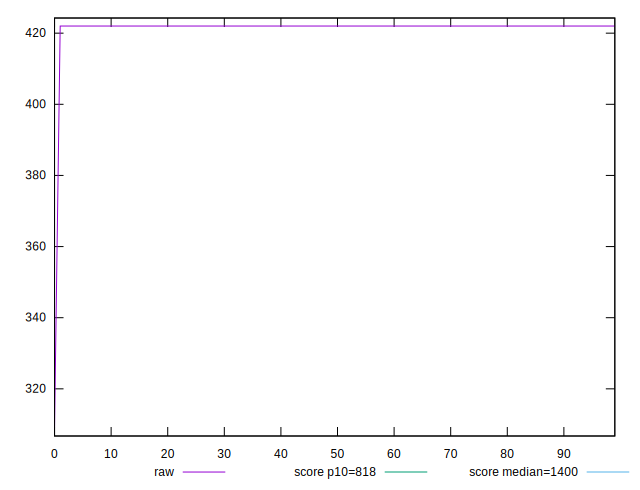
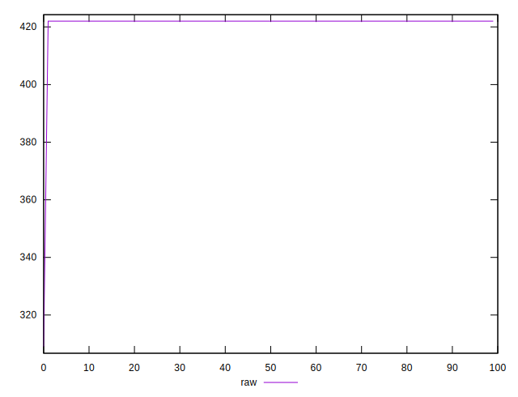
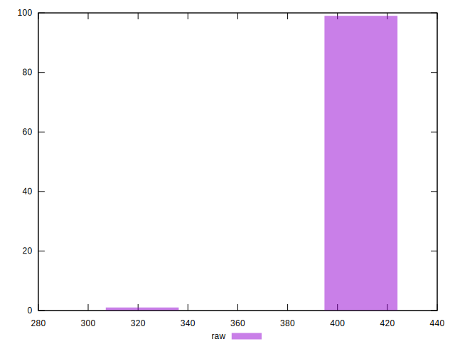
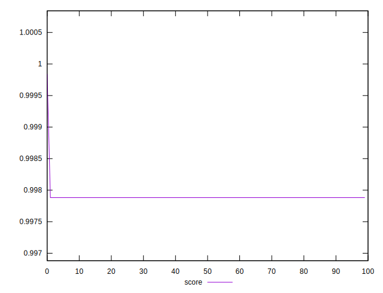
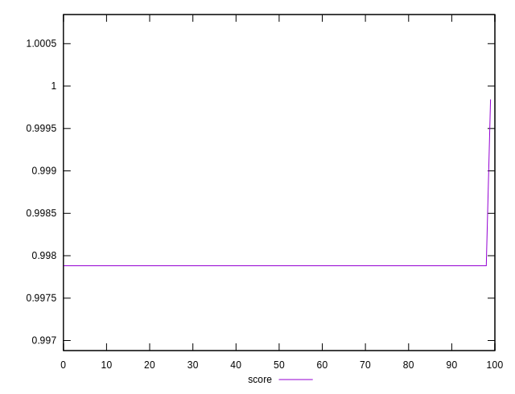
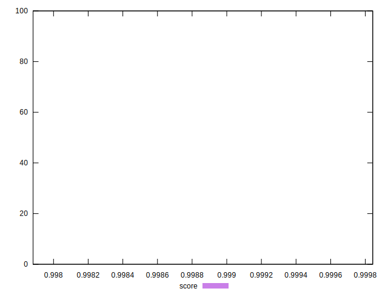

# //dom-size/samples/pages+cached

[→ Parent](../..)


## Raw


```yaml
p90min: 309
p90max: 422
p90range: 113
p90mean: 420.74444444444447
p90median: 422
p90stdev: 11.844887421359958
p90skewness: -9.32798134405592
p90eccentricity: 0.9999999999999996
p90discretization: 45
outlandishness: 1.0005969147824065

```


## Score


```yaml
p90min: 0.9978817385378554
p90max: 0.9978817385378554
p90range: 0
p90mean: 0.9978817385378561
p90median: 0.9978817385378554
p90stdev: 6.661338147750939e-16
p90skewness: -1
p90eccentricity: 1
p90discretization: 90
outlandishness: 1.000039305901647

```

