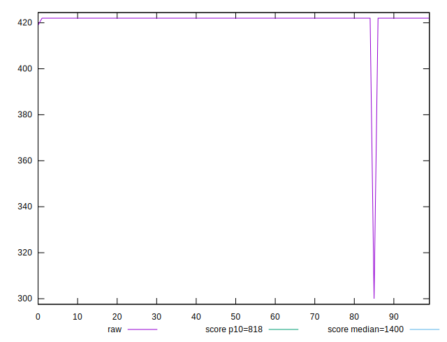
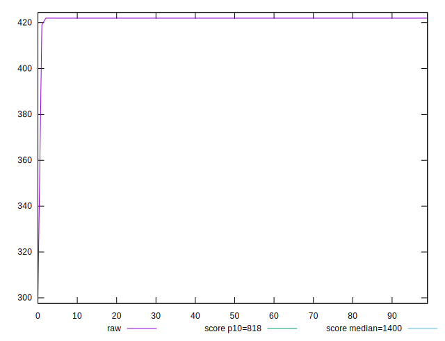
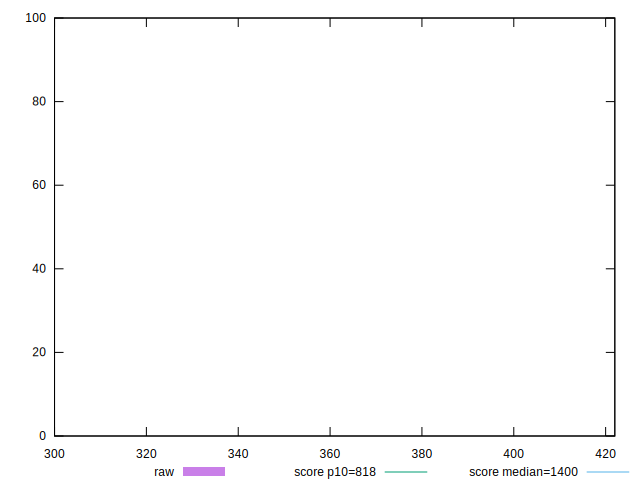
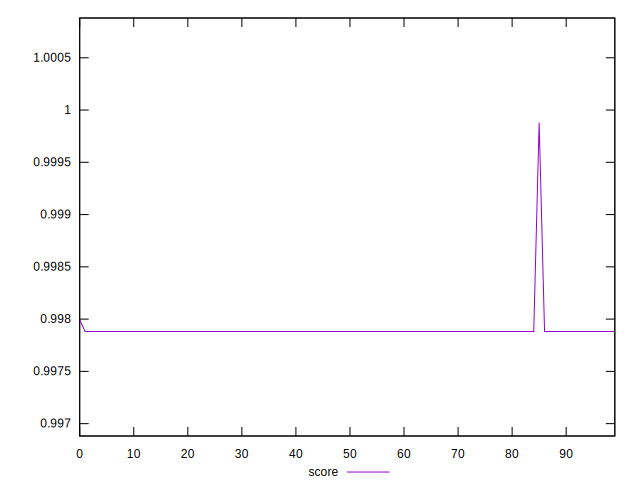
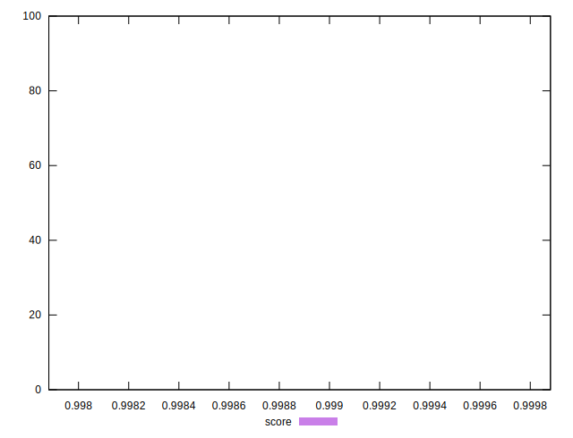

# //dom-size/samples/pages

[→ Parent](../..)


## Raw


```yaml
p90min: 300
p90max: 422
p90range: 122
p90mean: 420.6111111111111
p90median: 422
p90stdev: 12.788618589671787
p90skewness: -9.319469960091459
p90eccentricity: 1.0000000000000036
p90discretization: 30
outlandishness: 1.0006605237773643

```


## Score


```yaml
p90min: 0.9978817385378554
p90max: 0.9978817385378554
p90range: 0
p90mean: 0.9978817385378561
p90median: 0.9978817385378554
p90stdev: 6.661338147750939e-16
p90skewness: -1
p90eccentricity: 1
p90discretization: 90
outlandishness: 1.000042283065775

```

