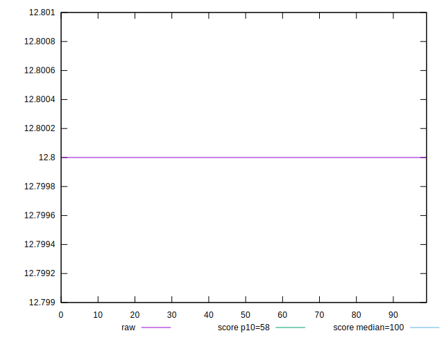

# //estimated-input-latency/samples/empty

[→ Parent](../..)


## Raw


```yaml
p90min: 12.8
p90max: 12.8
p90range: 0
p90mean: 12.799999999999978
p90median: 12.8
p90stdev: 2.3092638912203256e-14
p90skewness: 1
p90eccentricity: 1
p90discretization: 90
outlandishness: 0.9999999999999998

```


## Score


```yaml
p90min: 0.9999993380488856
p90max: 0.9999993380488856
p90range: 0
p90mean: 0.9999993380488851
p90median: 0.9999993380488856
p90stdev: 5.551115123125783e-16
p90skewness: 1
p90eccentricity: 1
p90discretization: 90
outlandishness: 0.9999999999999989

```

