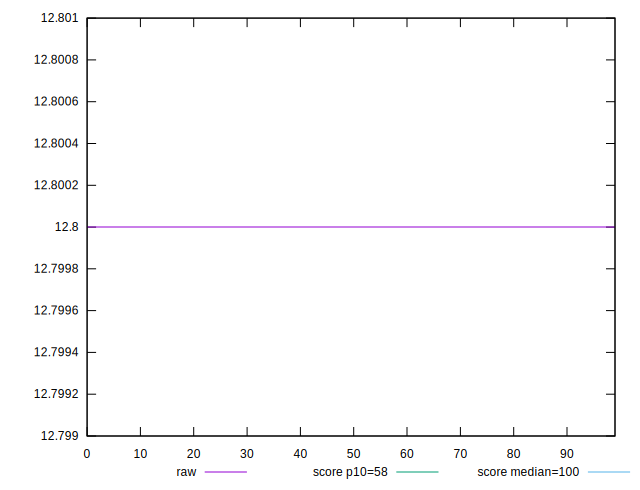
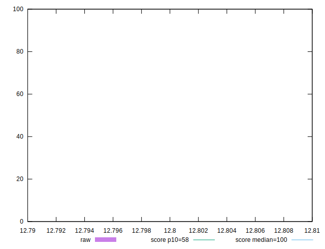
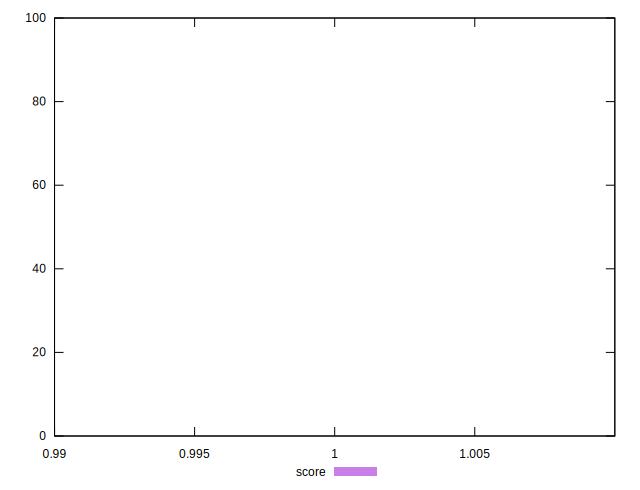

# //estimated-input-latency/samples/pages+cached+noexternal+nosvg

[→ Parent](../..)


## Raw


```yaml
p90min: 12.8
p90max: 12.8
p90range: 0
p90mean: 12.799999999999978
p90median: 12.8
p90stdev: 2.3092638912203256e-14
p90skewness: 1
p90eccentricity: 1
p90discretization: 91
outlandishness: 0.9999999999999998

```


## Score


```yaml
p90min: 0.9999993380488856
p90max: 0.9999993380488856
p90range: 0
p90mean: 0.999999338048885
p90median: 0.9999993380488856
p90stdev: 6.661338147750939e-16
p90skewness: 1
p90eccentricity: 1
p90discretization: 91
outlandishness: 0.9999999999999991

```


## P Score


```yaml
p90min: 0.9999993380488856
p90max: 0.9999993380488856
p90range: 0
p90mean: 0.999999338048885
p90median: 0.9999993380488856
p90stdev: 6.661338147750939e-16
p90skewness: 1
p90eccentricity: 1
p90discretization: 91
outlandishness: 0.9999999999999991

```


## Score Difference


```yaml
p90min: 6.619511143668433e-7
p90max: 6.619511143668433e-7
p90range: 0
p90mean: 6.619511143668433e-7
p90median: 6.619511143668433e-7
p90stdev: 0
p90skewness: .nan
p90eccentricity: .nan
p90discretization: 91
outlandishness: 1

```


## P Score Difference


```yaml
p90min: 0
p90max: 0
p90range: 0
p90mean: 0
p90median: 0
p90stdev: 0
p90skewness: .nan
p90eccentricity: .nan
p90discretization: 91
outlandishness: .nan

```

