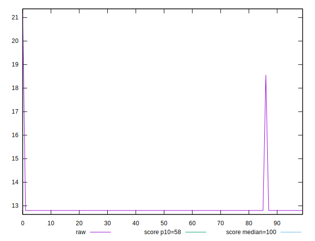
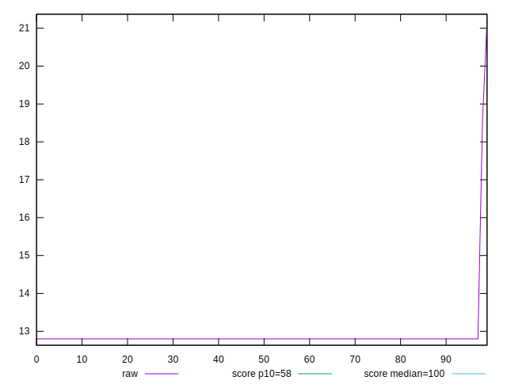
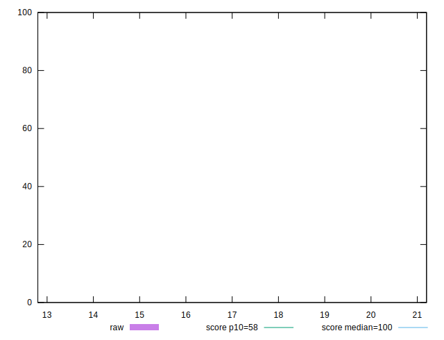
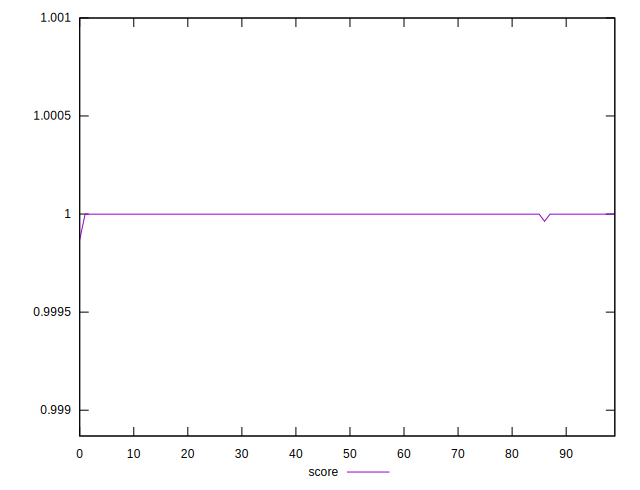
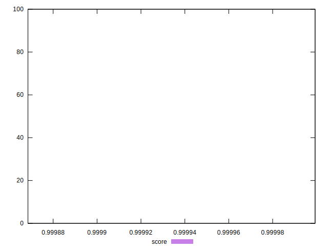

# //estimated-input-latency/samples/pages

[→ Parent](../..)


## Raw


```yaml
p90min: 12.8
p90max: 12.8
p90range: 0
p90mean: 12.799999999999978
p90median: 12.8
p90stdev: 2.3092638912203256e-14
p90skewness: 1
p90eccentricity: 1
p90discretization: 90
outlandishness: 1.02224737890625

```


## Score


```yaml
p90min: 0.999868516676541
p90max: 0.9999993380488856
p90range: 0.0001308213723446583
p90mean: 0.9999974791520986
p90median: 0.9999993380488856
p90stdev: 0.00001419466990788386
p90skewness: -8.491439490914994
p90eccentricity: 1.0000000000000064
p90discretization: 30
outlandishness: 1.0000003717803283

```

