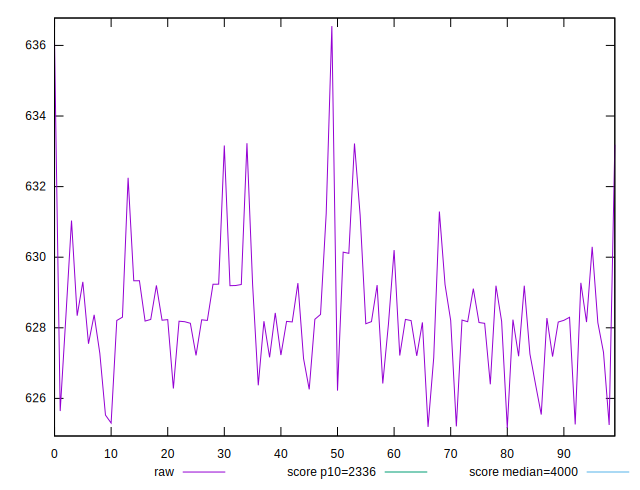
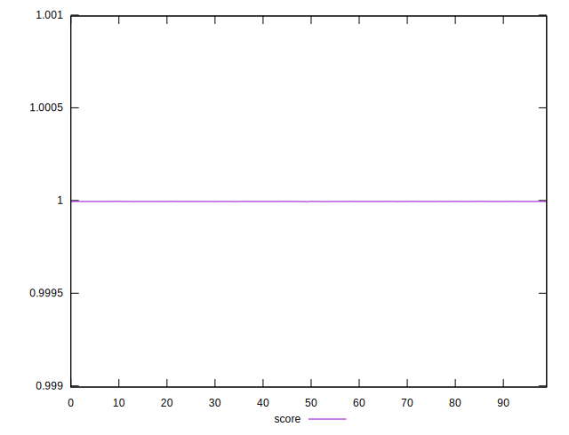
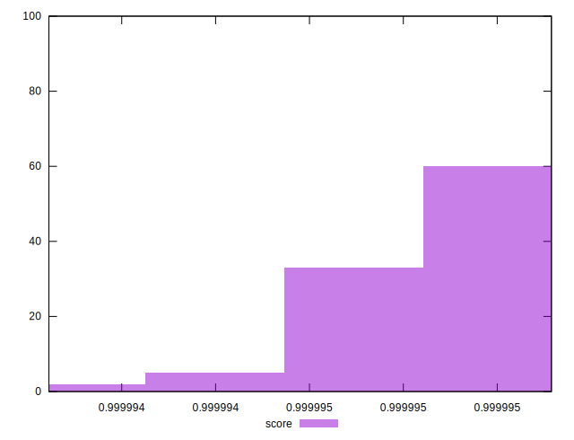

# //first-contentful-paint/samples/empty

[→ Parent](../..)


## Raw


```yaml
p90min: 625.16225
p90max: 631.038
p90range: 5.875750000000039
p90mean: 627.9517794444444
p90median: 628.1864
p90stdev: 1.2782676530691932
p90skewness: -0.45609745153662473
p90eccentricity: 1.0000000000000002
p90discretization: 1
outlandishness: 1.0016525878779043

```


## Score


```yaml
p90min: 0.9999940448449472
p90max: 0.9999950204595003
p90range: 9.756145530337434e-7
p90mean: 0.9999947899560554
p90median: 0.9999948449814213
p90stdev: 1.7587656508424636e-7
p90skewness: -2.041591900874893
p90eccentricity: 0.9999999999999999
p90discretization: 1
outlandishness: 1.0000000604652968

```

