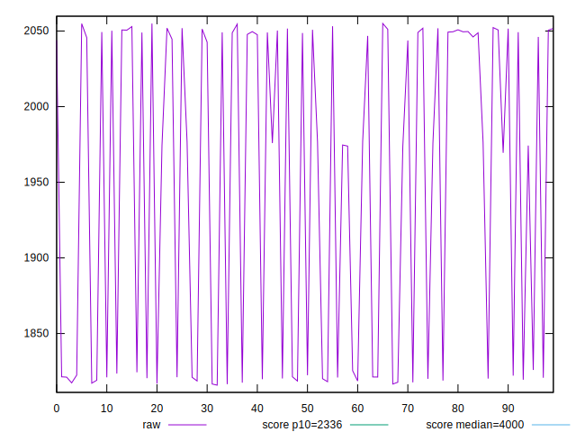
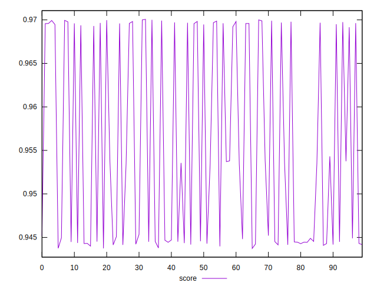

# //first-contentful-paint/samples/pages+cached+noadtech

[→ Parent](../..)


## Raw


```yaml
p90min: 1815.857
p90max: 2051.8097500000003
p90range: 235.95275000000038
p90mean: 1937.2918400000012
p90median: 1974.4894
p90stdev: 107.5439816472462
p90skewness: -0.09931674613438188
p90eccentricity: 1.0000000000000002
p90discretization: 1
outlandishness: 1.0120173246012685

```


## Score


```yaml
p90min: 0.943734639643558
p90max: 0.9698581658066622
p90range: 0.026123526163104205
p90mean: 0.9540456770905826
p90median: 0.945134418938745
p90stdev: 0.011412425792676765
p90skewness: 0.522523942572545
p90eccentricity: 0.9999999999999999
p90discretization: 1
outlandishness: 1.0033391449735267

```

