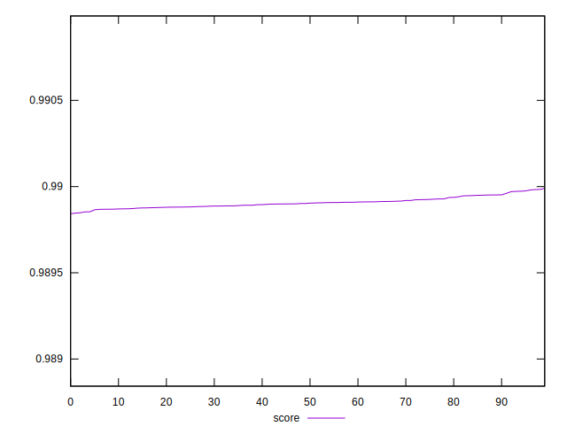
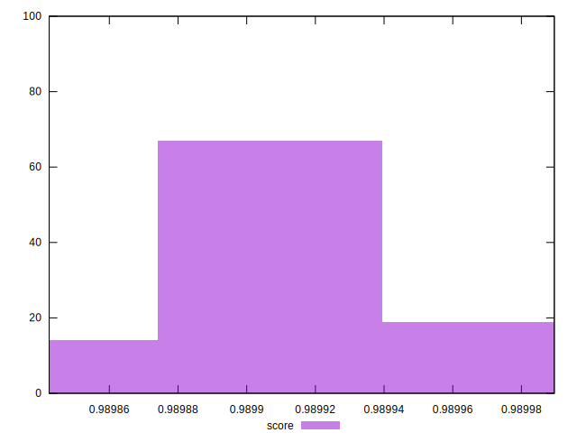

# //first-contentful-paint/samples/pages+cached+noexternal+nofonts+nosvg+noimg+nocss+nojs

[→ Parent](../..)


## Raw


```yaml
p90min: 1507.6709999999998
p90max: 1510.3714
p90range: 2.7004000000001724
p90mean: 1509.0685252747253
p90median: 1509.1147999999998
p90stdev: 0.6229805780038024
p90skewness: -0.28001023305962347
p90eccentricity: 0.9999999999999997
p90discretization: 1.011111111111111
outlandishness: 0.9998261926829626

```


## Score


```yaml
p90min: 0.9898462092486641
p90max: 0.9899608052971889
p90range: 0.00011459604852481764
p90mean: 0.9899015902956907
p90median: 0.9898996508811531
p90stdev: 0.00002643406596729589
p90skewness: 0.27600008723520686
p90eccentricity: 1.0000000000000002
p90discretization: 1.011111111111111
outlandishness: 1.0000112141812973

```

