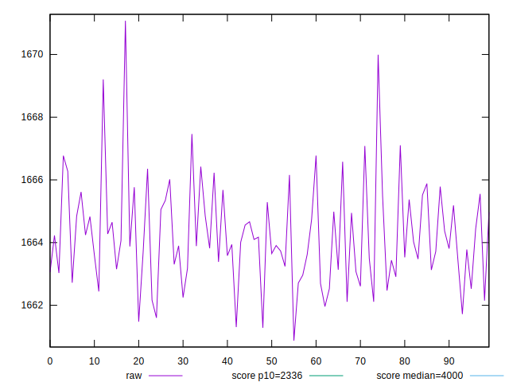

# //first-contentful-paint/samples/pages+cached+noexternal+nofonts+nosvg+noimg+nocss

[→ Parent](../..)


## Raw


```yaml
p90min: 1661.4770999999996
p90max: 1666.7752999999998
p90range: 5.298200000000179
p90mean: 1664.0525714285716
p90median: 1663.8876999999995
p90stdev: 1.3076139932898474
p90skewness: 0.2108333066678027
p90eccentricity: 1
p90discretization: 1
outlandishness: 1.0002272876698834

```


## Score


```yaml
p90min: 0.9815032347463908
p90max: 0.9818442266906124
p90range: 0.000340991944221658
p90mean: 0.9816788774276123
p90median: 0.9816896161245667
p90stdev: 0.00008417093370924801
p90skewness: -0.2165791750325359
p90eccentricity: 1.0000000000000004
p90discretization: 1
outlandishness: 0.9999749721555499

```

