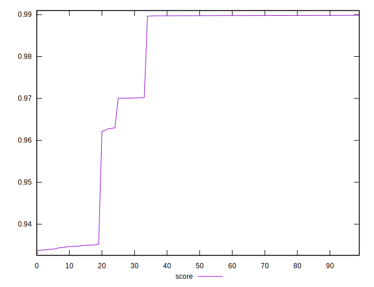

# //first-contentful-paint/samples/pages+cached+noexternal+nofonts

[→ Parent](../..)


## Raw


```yaml
p90min: 1510.4286000000002
p90max: 2121.0107
p90range: 610.5820999999996
p90mean: 1631.1586033333335
p90median: 1512.5775499999997
p90stdev: 209.90516108500736
p90skewness: 1.439887973549556
p90eccentricity: 0.9999999999999999
p90discretization: 1
outlandishness: 1.0614802243177217

```


## Score


```yaml
p90min: 0.933697425291549
p90max: 0.9897983086646659
p90range: 0.056100883373116917
p90mean: 0.9740089340042434
p90median: 0.9897307050353541
p90stdev: 0.022578288803739962
p90skewness: -0.9868415801744804
p90eccentricity: 1.0000000000000002
p90discretization: 1
outlandishness: 1.003249593408691

```

