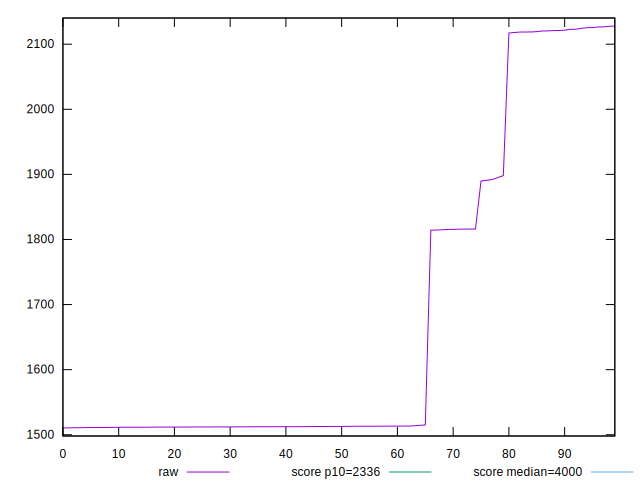
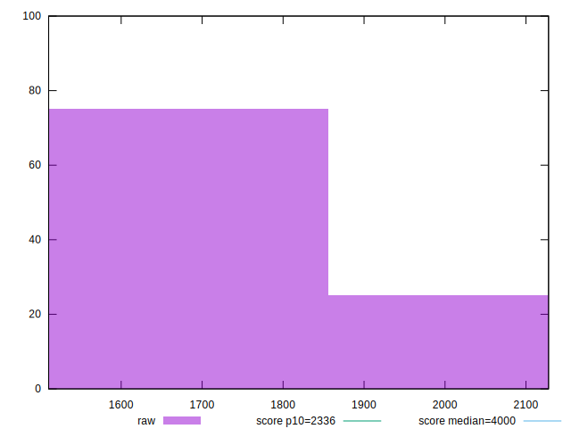
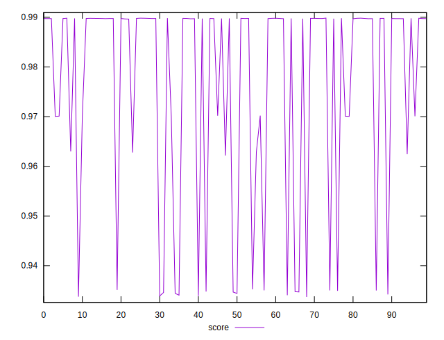
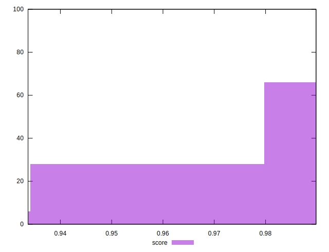

# //first-contentful-paint/samples/pages+cached+noexternal+nofonts

[→ Parent](../..)


## Raw


```yaml
p90min: 1510.4286000000002
p90max: 2121.58605
p90range: 611.1574499999997
p90mean: 1636.5479159340653
p90median: 1512.6099999999997
p90stdev: 214.9186381226493
p90skewness: 1.3820440854927267
p90eccentricity: 0.9999999999999999
p90discretization: 1
outlandishness: 1.0545006188147241

```


## Score


```yaml
p90min: 0.9345993493083513
p90max: 0.9898437718055635
p90range: 0.055244422497212176
p90mean: 0.9796996658371471
p90median: 0.9897505042390992
p90stdev: 0.018473255984053503
p90skewness: -1.6645173559629793
p90eccentricity: 1.0000000000000009
p90discretization: 1
outlandishness: 0.9916283932495901

```


## P Score


```yaml
p90min: 0.9345993493083513
p90max: 0.9898437718055635
p90range: 0.055244422497212176
p90mean: 0.9796996658371471
p90median: 0.9897505042390992
p90stdev: 0.018473255984053503
p90skewness: -1.6645173559629793
p90eccentricity: 1.0000000000000009
p90discretization: 1
outlandishness: 0.9916283932495901

```


## Score Difference


```yaml
p90min: -0.004681641826154603
p90max: 0.0003559170449779492
p90range: 0.0050375588711325525
p90mean: -0.0004886699788354262
p90median: 0.00021420192205323652
p90stdev: 0.0015123334581018213
p90skewness: -1.8423437552348125
p90eccentricity: 1.0000000000000002
p90discretization: 1
outlandishness: 1.006341253873664

```


## P Score Difference


```yaml
p90min: 0
p90max: 0
p90range: 0
p90mean: 0
p90median: 0
p90stdev: 0
p90skewness: .nan
p90eccentricity: .nan
p90discretization: 91
outlandishness: .nan

```

