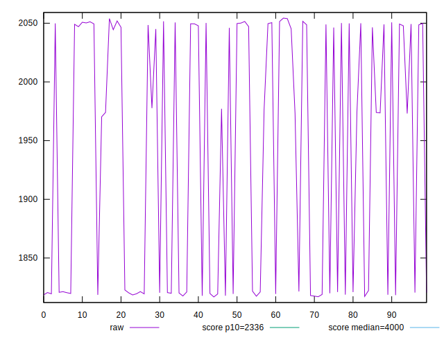
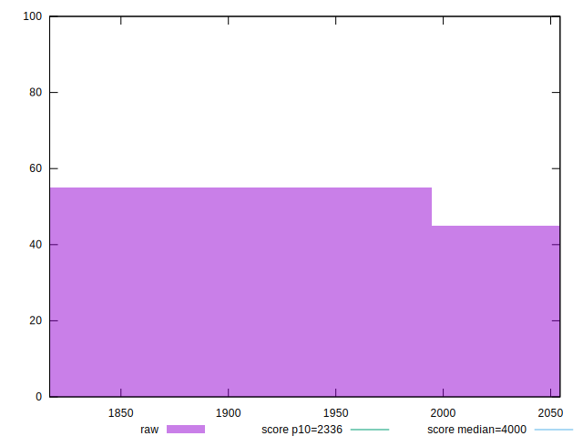
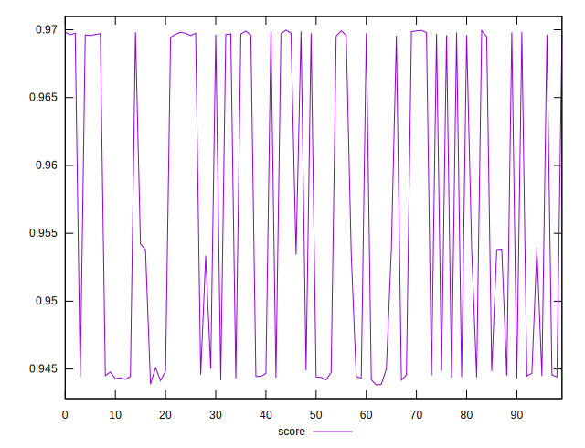
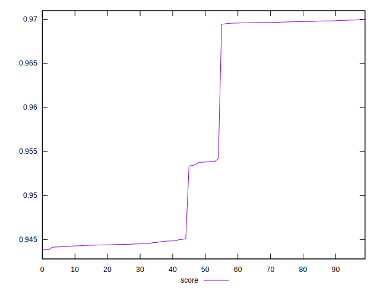
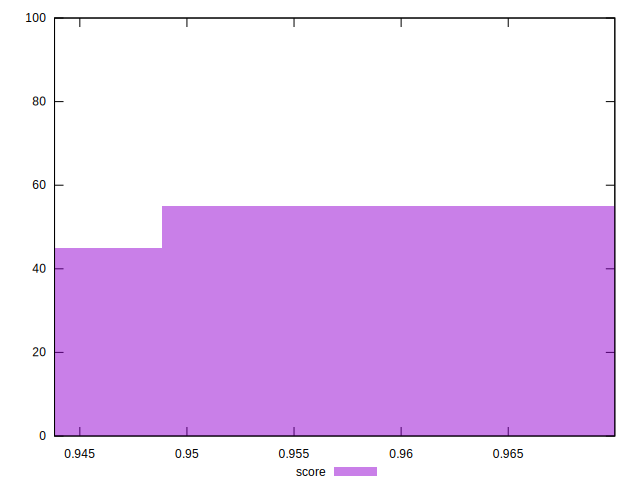

# //first-contentful-paint/samples/pages+cached+noexternal

[→ Parent](../..)


## Raw


```yaml
p90min: 1818.3901999999998
p90max: 2054.36825
p90range: 235.97805000000017
p90mean: 1950.471074725274
p90median: 1977.6609999999998
p90stdev: 107.80563715983902
p90skewness: -0.31452020950890935
p90eccentricity: 0.9999999999999997
p90discretization: 1
outlandishness: 0.9877661537174199

```


## Score


```yaml
p90min: 0.943818659790264
p90max: 0.9698363716171208
p90range: 0.02601771182685675
p90mean: 0.9554599469130047
p90median: 0.9533589819818202
p90stdev: 0.01183552167762805
p90skewness: 0.2882058402176866
p90eccentricity: 1.0000000000000002
p90discretization: 1
outlandishness: 1.0027252847299708

```


## P Score


```yaml
p90min: 0.943818659790264
p90max: 0.9698363716171208
p90range: 0.02601771182685675
p90mean: 0.9554599469130047
p90median: 0.9533589819818202
p90stdev: 0.01183552167762805
p90skewness: 0.2882058402176866
p90eccentricity: 1.0000000000000002
p90discretization: 1
outlandishness: 1.0027252847299708

```


## Score Difference


```yaml
p90min: -0.004677399332065124
p90max: 0.0005593028638650743
p90range: 0.0052367021959301985
p90mean: -0.001999352189238947
p90median: -0.003358981981820164
p90stdev: 0.002264447046486037
p90skewness: -0.0030853887187495864
p90eccentricity: 0.9999999999999997
p90discretization: 1
outlandishness: 0.9620144076592542

```


## P Score Difference


```yaml
p90min: 0
p90max: 0
p90range: 0
p90mean: 0
p90median: 0
p90stdev: 0
p90skewness: .nan
p90eccentricity: .nan
p90discretization: 91
outlandishness: .nan

```

