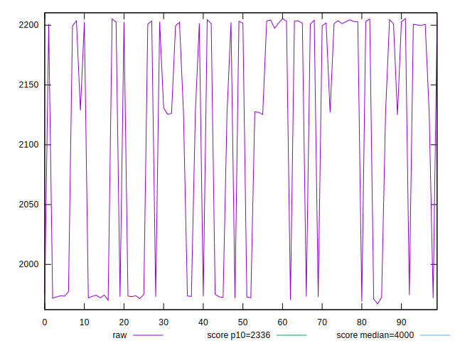
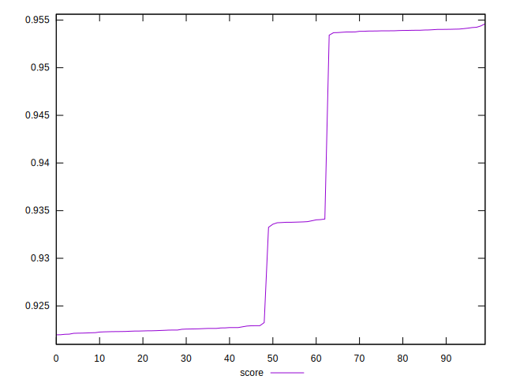

# //first-contentful-paint/samples/pages+cached+nointeractive

[→ Parent](../..)


## Raw


```yaml
p90min: 1971.9841000000001
p90max: 2205.583
p90range: 233.59889999999996
p90mean: 2120.3966010989006
p90median: 2199.5329499999993
p90stdev: 101.37623183280772
p90skewness: -0.6512574334076272
p90eccentricity: 0.9999999999999999
p90discretization: 1
outlandishness: 0.9873123635409286

```


## Score


```yaml
p90min: 0.9219679058503829
p90max: 0.9540233491611516
p90range: 0.032055443310768705
p90mean: 0.9338653143918454
p90median: 0.9229183052395455
p90stdev: 0.013891544856384224
p90skewness: 0.6180732203195951
p90eccentricity: 0.9999999999999996
p90discretization: 1
outlandishness: 1.0039234106479396

```

