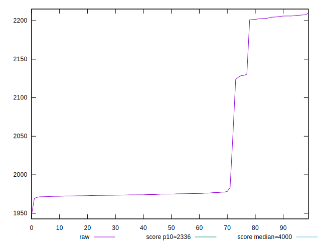
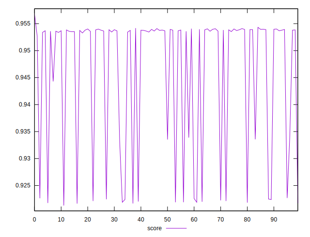

# //first-contentful-paint/samples/pages+cached

[→ Parent](../..)


## Raw


```yaml
p90min: 1947.971
p90max: 2206.01295
p90range: 258.0419499999998
p90mean: 2015.8922027472534
p90median: 1974.5679000000002
p90stdev: 84.48461690953835
p90skewness: 1.5899526186708801
p90eccentricity: 0.9999999999999996
p90discretization: 1
outlandishness: 1.017141178554205

```


## Score


```yaml
p90min: 0.921900128133947
p90max: 0.9567701181098782
p90range: 0.03486998997593127
p90mean: 0.9481030400535285
p90median: 0.9537216793440335
p90stdev: 0.011511190228597859
p90skewness: -1.6167274732795778
p90eccentricity: 1.0000000000000004
p90discretization: 1
outlandishness: 0.9950005620610253

```

