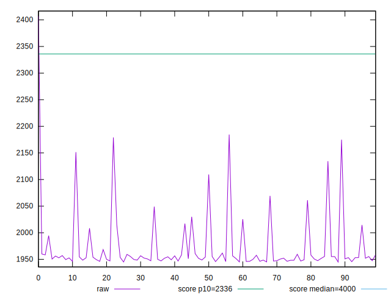
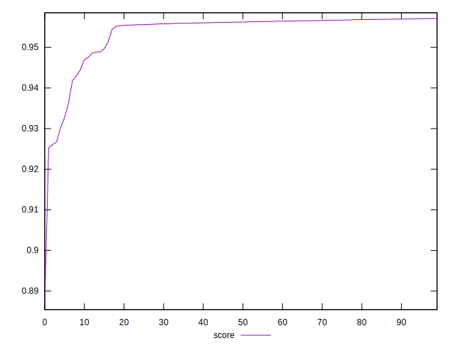
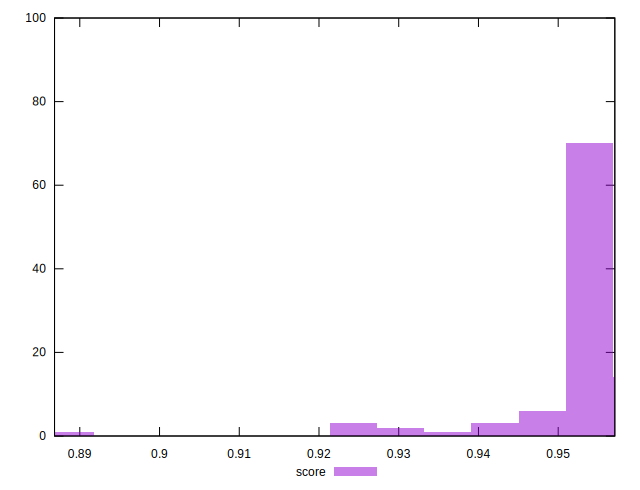

# //first-contentful-paint/samples/pages

[→ Parent](../..)


## Raw


```yaml
p90min: 1945.0035000000003
p90max: 2049.086
p90range: 104.08249999999953
p90mean: 1957.7081373626368
p90median: 1952.103
p90stdev: 20.145262957906986
p90skewness: 2.915141001079126
p90eccentricity: 0.9999999999999992
p90discretization: 1
outlandishness: 1.0190153684469114

```


## Score


```yaml
p90min: 0.944509232458316
p90max: 0.957102437565996
p90range: 0.012593205107680028
p90mean: 0.9556325424080058
p90median: 0.9563047830976553
p90stdev: 0.0024019444157021624
p90skewness: -2.9708780038333633
p90eccentricity: 1.0000000000000007
p90discretization: 1
outlandishness: 0.9947379319393961

```


## P Score


```yaml
p90min: 0.944509232458316
p90max: 0.957102437565996
p90range: 0.012593205107680028
p90mean: 0.9556325424080058
p90median: 0.9563047830976553
p90stdev: 0.0024019444157021624
p90skewness: -2.9708780038333633
p90eccentricity: 1.0000000000000007
p90discretization: 1
outlandishness: 0.9947379319393961

```


## Score Difference


```yaml
p90min: 0.0011361004153295218
p90max: 0.004803668751931056
p90range: 0.0036675683366015344
p90mean: 0.003572466477574076
p90median: 0.0035485433673092537
p90stdev: 0.0006162464143080132
p90skewness: -0.7776994843214895
p90eccentricity: 0.9999999999999997
p90discretization: 1
outlandishness: 0.7457535284600335

```


## P Score Difference


```yaml
p90min: 0
p90max: 0
p90range: 0
p90mean: 0
p90median: 0
p90stdev: 0
p90skewness: .nan
p90eccentricity: .nan
p90discretization: 91
outlandishness: .nan

```

